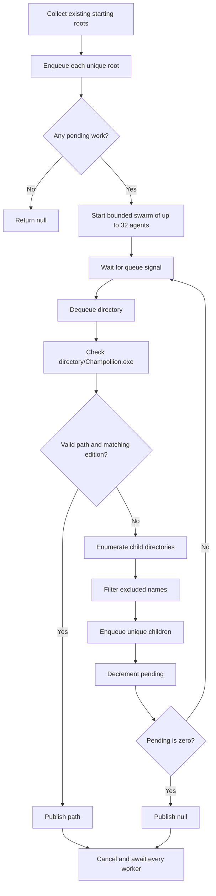

# Automatic Executable Search

## Purpose

The automatic executable search locates the first compatible `Champollion.exe` on a local fixed drive without blocking the user interface. It uses a bounded swarm of workers to search multiple directory trees concurrently, rejects unsupported paths, distinguishes the Legacy and Current editions, reports progress, and cooperatively stops the swarm after success, exhaustion, or cancellation.

The implementation is primarily owned by:

- `src/ChampollionGraphicalUserInterface.Application/Search/ExecutableSearchService.cs`
- `src/ChampollionGraphicalUserInterface.Application/Search/ChampollionExecutableClassifier.cs`
- `src/ChampollionGraphicalUserInterface.Application/Validation/LocalPathValidator.cs`

## Inputs and Result

`ExecutableSearchService.FindAsync` accepts:

- The requested `ChampollionEdition`.
- An optional `IProgress<SearchProgress>` receiver.
- An optional `CancellationToken`.

It returns the full path of the first validated executable that matches the requested edition. It returns `null` if all reachable directories are exhausted without a match. Caller cancellation is propagated as `OperationCanceledException` after all workers have been stopped and awaited.

"First" means the first worker to complete validation and classification successfully. Concurrent scheduling and filesystem response times make the winning path nondeterministic when multiple valid installations exist.

## Starting Directories

The production search seeds its work queue with existing directories from these sources, in this order:

1. The application directory.
2. The current user's profile directory.
3. The Desktop directory.
4. The Documents directory.
5. The Downloads directory.
6. The root of every ready local fixed drive.

Steam, Epic, and GOG directories do not receive special priority. They are searched normally when the swarm reaches them from another starting root, such as the root of a fixed drive.

Starting roots can overlap. For example, the user profile and `C:\` may both lead to the same descendants. The visited set deduplicates identical path strings, case-insensitively, when each path is enqueued.

## Excluded Directories

Before a child directory is enqueued, its final path component is compared case-insensitively with the exclusion list:

- `Windows`
- `ProgramData`
- `Microsoft`
- `Visual Studio`

A matching directory and its complete subtree are skipped. The comparison uses only the immediate directory name, not the full path. A directory named `Microsoft` is therefore excluded wherever it appears.

The exclusion check is a traversal optimization and scope boundary. It is separate from path validation: exclusions decide which trees are visited, while validation decides whether a discovered executable is an acceptable local path.

## Swarm Worker Approach

The algorithm follows a swarm-worker approach. A bounded group of independent search agents draws directories from one shared concurrent queue. Each agent can discover more directories and return them to the queue for any available agent to process. This distributes unrelated directory trees across the machine instead of assigning the entire traversal to one sequential walker.

The swarm shares only coordination state: the queue, visited-path set, availability signal, counters, result, and cancellation source. No agent owns a permanent subtree. This allows idle agents to take newly discovered work while slower agents wait on filesystem I/O.

### Swarm Size

The search is I/O-bound, so it permits more swarm agents than available logical processors:

```text
workerCount = clamp(logicalProcessorCount * 2, 4, 32)
```

This gives at least 4 swarm agents, scales to 2 agents per logical processor, and allows a maximum of 32 agents to search at one time. The processor count determines the configured swarm size. The hard ceiling keeps the swarm within practical CPU, native-thread, and filesystem I/O limits; the implementation does not dynamically measure storage throughput.

Each swarm agent is a worker created with `TaskCreationOptions.LongRunning`. Directory enumeration and file metadata checks are synchronous and can block, so dedicated workers avoid depending on thread-pool ramp-up to achieve concurrency. The swarm size remains fixed for the lifetime of one search, although the number of actively searching agents varies with available queue work and I/O latency.

## Shared Search State

The workers coordinate through these thread-safe structures and atomic counters:

| State | Type | Purpose |
| --- | --- | --- |
| `work` | `ConcurrentQueue<string>` | Holds directories waiting to be searched. |
| `visited` | `ConcurrentDictionary<string, byte>` | Prevents the same path from being enqueued more than once. |
| `available` | `SemaphoreSlim` | Signals that one queued directory is available. |
| `pending` | Atomic `int` | Counts queued or currently processing directories. |
| `directoriesSearched` | Atomic `int` | Counts directories whose processing has started. |
| `activeWorkers` | Atomic `int` | Counts workers currently processing directories. |
| `result` | `TaskCompletionSource<string?>` | Publishes the first match or search exhaustion. |

The result source uses `RunContinuationsAsynchronously`, preventing completion continuations from running inline on a filesystem worker.

## Enqueue Invariant

All roots and discovered children enter the queue through one local `Enqueue` operation:

1. Add the directory to `visited`.
2. If it was already present, stop.
3. Increment `pending`.
4. Add the directory to `work`.
5. Release one semaphore permit.

The ordering is important. Incrementing `pending` before publishing work prevents another worker from observing the search as complete while newly discovered work is being added.

At all stable points during the search:

```text
pending = queued directories + directories currently being processed
```

## Worker Loop

Each swarm agent repeats the following sequence:

1. Wait for a semaphore permit or cancellation.
2. Dequeue one directory.
3. Increment the active-worker and searched-directory counters.
4. Report progress.
5. Build the candidate path `<directory>/Champollion.exe`.
6. Validate the candidate path.
7. Classify a valid candidate and compare it with the requested edition.
8. If it matches, publish the path and cancel the other workers.
9. Otherwise enumerate child directories and enqueue children that are not excluded.
10. Decrement the active-worker and pending counters in a `finally` block.
11. If `pending` reaches zero, publish `null` and cancel all waiting workers.

The queue produces breadth-first-like behavior, but strict breadth-first ordering is not guaranteed. Multiple workers enumerate and enqueue children concurrently, and overlapping starting roots are processed at the same time.



## Candidate Validation

A candidate must pass `LocalPathValidator.ValidateExecutable` before classification. Validation requires:

- A nonempty path.
- Successful environment-variable expansion and full-path normalization.
- A fully qualified path.
- A path that is not UNC syntax.
- A drive whose `DriveType` is `Fixed`.
- An existing file with the `.exe` extension.

Malformed-path, filesystem, unsupported-path, and access exceptions handled by the validator become an invalid result instead of escaping into the search.

## Edition Classification

A validated executable is classified from files beside it and its version metadata.

### Legacy

An executable is Legacy only when all of these companion files exist in the same directory:

- `Decompiler.dll`
- `Pex.dll`
- `vcredist_x64.exe`

It must also have `doc/Readme.html` beneath the same directory.

### Unknown

An installation is Unknown when:

- It has only some Legacy markers, which indicates an incomplete or ambiguous Legacy layout; or
- Its file version reports major version 1 and minor version 0 without the complete Legacy layout.

Unknown executables never satisfy either requested edition.

### Current

An existing executable is Current when it has no Legacy markers and is not identified as version 1.0. A standalone `Champollion.exe` with no Legacy companion files therefore classifies as Current.

## Progress Reporting

Progress is emitted when a worker begins processing a directory. Each `SearchProgress` value contains:

- `DirectoriesSearched`: the number of directories whose processing has started.
- `ActiveWorkers`: the number of workers processing a directory at the instant of reporting.
- `WorkerCount`: the configured maximum number of workers.

`ActiveWorkers` may be lower than `WorkerCount` when the queue briefly lacks enough work, workers are blocked in different operations, or cancellation has begun. Progress reports can arrive close together and should be treated as snapshots rather than a strictly serialized event log.

## Completion and Cancellation

The search uses a linked cancellation source combining caller cancellation with internal completion.

There are three completion paths:

- **Match:** the winning worker stores the candidate path and triggers internal cancellation.
- **Exhaustion:** the worker that decrements `pending` to zero stores `null` and triggers internal cancellation.
- **Caller cancellation:** waiting and active workers observe the caller's token through the linked source.

`FindAsync` always executes a final cleanup block that cancels the linked source and awaits `Task.WhenAll(workers)`. The method therefore does not leave background search workers running after it returns or throws.

Workers treat cancellation as normal shutdown by catching `OperationCanceledException`. Access-denied and I/O failures while enumerating a directory are also contained; that inaccessible subtree is skipped while the rest of the search continues.

## Complexity

Let:

- $D$ be the number of reachable, non-excluded directories.
- $W$ be the configured worker count, where $4 \le W \le 32$.

Each unique enqueued directory is processed at most once for an exact case-insensitive path string. The algorithmic work is therefore $O(D)$, plus filesystem costs for candidate checks, classification, and child enumeration.

The idealized elapsed time is approximately $O(D / W)$, but real performance is bounded by storage latency, filesystem cache behavior, directory fan-out, access failures, and contention. Raising $W$ does not guarantee proportional acceleration.

Memory usage is $O(D)$ in the worst case because `visited` retains every enqueued path for the duration of the search and the queue may hold many discovered directories. Each long-running worker also has native thread-stack overhead that is not represented entirely by managed heap measurements.

## Behavioral Guarantees

The design provides these guarantees:

- Only existing local fixed-drive executables are accepted.
- Each exact path string is enqueued at most once per search, case-insensitively.
- Worker creation is bounded.
- The first successful match wins atomically.
- A failed or inaccessible directory does not stop other workers.
- Search completion and cancellation await every worker.
- Excluded directory subtrees are never traversed.

The design does not guarantee:

- Deterministic selection among multiple matching installations.
- Strict breadth-first traversal.
- Discovery beneath an excluded directory.
- Discovery through junction aliases as one canonical identity; differently spelled paths can still represent the same underlying directory.
- Linear speedup as worker count increases.

## Test Coverage

`ExecutableSearchServiceTests` covers:

- Concurrent traversal of independent roots.
- Worker-count scaling and its upper bound.
- Selection of only the requested edition.
- Traversal under Program Files and Program Files (x86)-shaped directories.
- Traversal through Steam-shaped directories.
- Exclusion of protected system directory names.

`ChampollionExecutableClassifierTests` covers the distinction between a complete Legacy layout and a standalone Current executable.
