# Application Project UML Class Diagram

## Purpose

This diagram contains every production class, record, and enum in `ChampollionGraphicalUserInterface.Application`. It shows retained collaborators, DTO ownership, behavior dependencies, and references to Domain types.

## Diagram

```mermaid
classDiagram
    direction TB

    namespace CommandLine {
        class ChampollionCommandBuilder {
            <<static>>
            +BuildArguments(request, inputPath) IReadOnlyList~string~
        }
    }

    namespace DTO_Input {
        class AppSettings {
            <<record>>
            +string? LegacyExecutablePath
            +string? CurrentExecutablePath
            +SupportedGame LastLegacyGame
            +SupportedGame LastCurrentGame
            +Dictionary~string,SavedOptions~ EditionGameOptions
        }
        class SavedOptions {
            <<record>>
            +bool GenerateAssembly
            +bool GenerateComments
            +bool Recursive
            +bool RecreateSubdirectories
            +bool WriteHeader
            +bool Trace
            +bool NoDumpTree
            +bool DebugFunctions
            +bool NoDebugLineNumbers
            +bool Verbose
        }
    }

    namespace DTO_Output {
        class ExecutionOutput {
            <<record>>
            +string? InputPath
            +bool IsError
            +string Text
        }
        class ExecutionProgress {
            <<record>>
            +int Completed
            +int Total
            +string CurrentInput
        }
        class ExecutionSummary {
            <<record>>
            +IReadOnlyList~FileExecutionResult~ Results
            +string? LogPath
            +int SuccessfulCount
            +int FailedCount
        }
        class FileExecutionResult {
            <<record>>
            +string? InputPath
            +int ExitCode
            +string StandardOutput
            +string StandardError
            +bool Succeeded
        }
        class PathValidationResult {
            <<record>>
            +bool IsValid
            +string? ExpandedPath
            +string? Error
        }
        class SearchProgress {
            <<record>>
            +int DirectoriesSearched
            +int ActiveWorkers
            +int WorkerCount
        }
    }

    namespace Enums {
        class ExecutableClassification {
            <<enumeration>>
            Unknown
            Legacy
            Current
        }
    }

    namespace Execution {
        class ChampollionRunner {
            +RunAsync(request, progress, output, cancellationToken) Task~ExecutionSummary~
        }
        class DiagnosticLogWriter {
            -string logDirectory
            +WriteAsync(request, results, cancellationToken) Task~string~
        }
    }

    namespace Paths {
        class ApplicationOutputPaths {
            <<static>>
            +string SourceDirectoryName
            +string AssemblyDirectoryName
            +GetSourceDirectory(applicationDirectory) string
            +GetAssemblyDirectory(applicationDirectory) string
            +GetDirectories(applicationDirectory) IReadOnlyList~string~
        }
    }

    namespace Search {
        class ChampollionExecutableClassifier {
            +Classify(executablePath) ExecutableClassification
            +Matches(executablePath, edition) bool
        }
        class ExecutableSearchService {
            +string ExpectedExecutableFileName
            +FindAsync(edition, progress, cancellationToken) Task~string?~
        }
    }

    namespace Settings {
        class AppSettingsStore {
            -string dataDirectory
            -string settingsPath
            -string legacyDataDirectory
            +string SettingsPath
            +string SettingsDirectory
            +LoadAsync(cancellationToken) Task~AppSettings~
            +SaveAsync(settings, cancellationToken) Task
            +GetOptions(settings, edition, game) SavedOptions?
            +SetOptions(settings, edition, game, options) void
        }
    }

    namespace Validation {
        class CompatibilityRules {
            <<static>>
            +GamesFor(edition) IReadOnlyList~SupportedGame~
            +SupportsCurrentOptions(edition) bool
            +SupportsRecreateSubdirectories(edition, game) bool
            +RequiresInput(operation) bool
            +Validate(request) IReadOnlyList~string~
        }
        class LocalPathValidator {
            -string[] allowedProtectedOutputRoots
            +ValidateInput(path) PathValidationResult
            +ValidateExecutable(path) PathValidationResult
            +ValidateOutput(path) PathValidationResult
        }
    }

    namespace Domain_Project {
        class ChampollionRequest {
            <<external record>>
        }
        class DecompilationOptions {
            <<external record>>
        }
        class ChampollionEdition {
            <<external enumeration>>
        }
        class ChampollionOperation {
            <<external enumeration>>
        }
        class SupportedGame {
            <<external enumeration>>
        }
    }

    AppSettings "1" *-- "0..*" SavedOptions : EditionGameOptions
    AppSettings --> SupportedGame : remembered games
    ExecutionSummary "1" *-- "0..*" FileExecutionResult : Results

    ChampollionRunner o-- LocalPathValidator : validates with
    ChampollionRunner o-- DiagnosticLogWriter : logs with
    ChampollionRunner ..> CompatibilityRules : validates compatibility
    ChampollionRunner ..> ChampollionCommandBuilder : builds arguments
    ChampollionRunner ..> ChampollionRequest : executes
    ChampollionRunner ..> PathValidationResult : inspects
    ChampollionRunner ..> ExecutionOutput : reports
    ChampollionRunner ..> ExecutionProgress : reports
    ChampollionRunner ..> FileExecutionResult : creates
    ChampollionRunner ..> ExecutionSummary : returns

    DiagnosticLogWriter ..> ChampollionRequest : records
    DiagnosticLogWriter ..> FileExecutionResult : records
    ChampollionCommandBuilder ..> ChampollionRequest : translates
    ChampollionCommandBuilder ..> DecompilationOptions : reads

    ExecutableSearchService o-- LocalPathValidator : validates candidates
    ExecutableSearchService o-- ChampollionExecutableClassifier : classifies with
    ExecutableSearchService ..> SearchProgress : reports
    ExecutableSearchService ..> ChampollionEdition : searches for
    ChampollionExecutableClassifier ..> ExecutableClassification : returns
    ChampollionExecutableClassifier ..> ChampollionEdition : matches

    AppSettingsStore ..> AppSettings : loads and saves
    AppSettingsStore ..> SavedOptions : reads and stores
    AppSettingsStore ..> ChampollionEdition : keys profile
    AppSettingsStore ..> SupportedGame : keys profile

    LocalPathValidator ..> PathValidationResult : returns
    CompatibilityRules ..> ChampollionRequest : validates
    CompatibilityRules ..> DecompilationOptions : inspects
    CompatibilityRules ..> ChampollionEdition : evaluates
    CompatibilityRules ..> ChampollionOperation : evaluates
    CompatibilityRules ..> SupportedGame : evaluates
```

## Relationship Summary

- `ChampollionRunner` aggregates validation and diagnostic collaborators, then coordinates static compatibility and command-building services to produce execution DTOs.
- `ExecutableSearchService` retains a validator and classifier; classification returns the Application-owned `ExecutableClassification` enum while matching the Domain edition.
- `AppSettingsStore` owns persistence behavior for `AppSettings`, whose profile dictionary composes zero or more `SavedOptions` values.
- `ExecutionSummary` composes the per-input `FileExecutionResult` records returned from one run.
- `LocalPathValidator` is the sole producer of `PathValidationResult`; the remaining output records carry search and execution information toward the GUI.
- Domain types are shown as external collaborators because Application references Domain, but Domain does not reference Application.