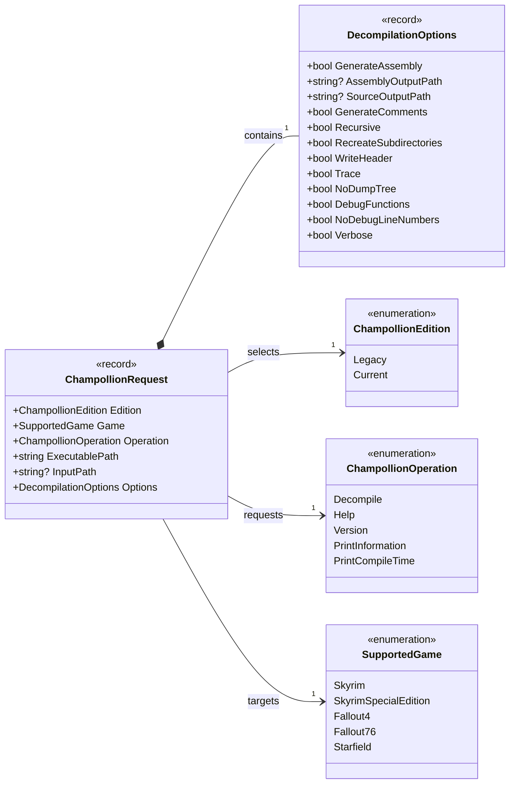

# Domain Project UML Class Diagram

## Purpose

This diagram contains every production type in `ChampollionGraphicalUserInterface.Domain` and shows how one invocation owns its options and references the stable domain vocabulary.

## Diagram

## Relationships

- `ChampollionRequest` is the aggregate request passed from GUI orchestration into Application execution.
- Each request contains exactly one `DecompilationOptions` value and one value from each domain enum.
- Domain types do not depend on Application, Avalonia, operating-system APIs, or external packages.