# GUI Project UML Class Diagram

## Purpose

This diagram contains every hand-written production class in the `ChampollionGraphicalUserInterface` Avalonia project. It shows framework inheritance, interface realization, GUI-class relationships, and abbreviated Application and Domain collaborators.

## Diagram

```mermaid
classDiagram
    direction TB

    namespace GUI_Root {
        class Program {
            <<entry point>>
            +Main(args) void
            +BuildAvaloniaApp() AppBuilder
        }
        class App {
            <<partial>>
            +Initialize() void
            +OnFrameworkInitializationCompleted() void
        }
        class ViewLocator {
            +Build(param) Control?
            +Match(data) bool
        }
    }

    namespace Views {
        class MainWindow {
            <<partial>>
            -MainViewModel subscribedViewModel
            -MainViewModel ViewModel
            -BrowseExecutable_Click(sender, eventArgs) void
            -BrowseInputFile_Click(sender, eventArgs) void
            -Run_Click(sender, eventArgs) void
            -CopyOutput_Click(sender, eventArgs) void
            -OpenLegalDocument(fileName) void
        }
    }

    namespace ViewModels {
        class ViewModelBase {
            <<abstract>>
        }
        class MainViewModel {
            <<partial>>
            -LocalPathValidator pathValidator
            -ChampollionRunner runner
            -ExecutableSearchService searchService
            -AppSettingsStore settingsStore
            -AppSettings settings
            +IReadOnlyList~ChampollionEdition~ Editions
            +IReadOnlyList~ChampollionOperation~ Operations
            +ObservableCollection~SupportedGame~ Games
            +bool CanRun
            +string SettingsLocation
            +InitializeAsync() Task
            +UseApplicationDirectory() void
            +RunAsync() Task
            +ResolveOutputDirectory(path) string?
        }
    }

    namespace Converters {
        class EnumDisplayNameConverter {
            <<partial>>
            +Convert(value, targetType, parameter, culture) object
            +ConvertBack(value, targetType, parameter, culture) object
        }
    }

    namespace Avalonia_Framework {
        class AvaloniaApplication {
            <<external>>
        }
        class Window {
            <<external>>
        }
        class Control {
            <<external>>
        }
        class ObservableObject {
            <<external>>
        }
        class IDataTemplate {
            <<external interface>>
        }
        class IValueConverter {
            <<external interface>>
        }
        class AppBuilder {
            <<external>>
        }
    }

    namespace Application_Project {
        class LocalPathValidator {
            <<external>>
        }
        class ChampollionRunner {
            <<external>>
        }
        class DiagnosticLogWriter {
            <<external>>
        }
        class ExecutableSearchService {
            <<external>>
        }
        class AppSettingsStore {
            <<external>>
        }
        class CompatibilityRules {
            <<external static>>
        }
        class ApplicationOutputPaths {
            <<external static>>
        }
        class AppSettings {
            <<external record>>
        }
        class SavedOptions {
            <<external record>>
        }
        class ExecutionOutput {
            <<external record>>
        }
        class ExecutionProgress {
            <<external record>>
        }
        class ExecutionSummary {
            <<external record>>
        }
    }

    namespace Domain_Project {
        class ChampollionRequest {
            <<external record>>
        }
        class DecompilationOptions {
            <<external record>>
        }
        class ChampollionEdition {
            <<external enumeration>>
        }
        class ChampollionOperation {
            <<external enumeration>>
        }
        class SupportedGame {
            <<external enumeration>>
        }
    }

    AvaloniaApplication <|-- App
    Window <|-- MainWindow
    ObservableObject <|-- ViewModelBase
    ViewModelBase <|-- MainViewModel
    IDataTemplate <|.. ViewLocator
    IValueConverter <|.. EnumDisplayNameConverter

    Program ..> App : configures
    Program ..> AppBuilder : returns
    App *-- MainWindow : creates main window
    App *-- MainViewModel : creates data context
    App ..> LocalPathValidator : constructs
    App ..> ChampollionRunner : constructs
    App ..> DiagnosticLogWriter : constructs
    App ..> ExecutableSearchService : constructs
    App ..> AppSettingsStore : constructs
    App ..> ApplicationOutputPaths : gets allowed roots

    MainWindow --> MainViewModel : DataContext and events
    ViewLocator ..> ViewModelBase : matches
    ViewLocator ..> Control : returns and creates by convention

    MainViewModel o-- LocalPathValidator : retains
    MainViewModel o-- ChampollionRunner : retains
    MainViewModel o-- ExecutableSearchService : retains
    MainViewModel o-- AppSettingsStore : retains
    MainViewModel *-- AppSettings : current settings
    MainViewModel ..> CompatibilityRules : evaluates selections
    MainViewModel ..> ApplicationOutputPaths : resets defaults
    MainViewModel ..> SavedOptions : maps profiles
    MainViewModel ..> ExecutionOutput : consumes
    MainViewModel ..> ExecutionProgress : consumes
    MainViewModel ..> ExecutionSummary : consumes
    MainViewModel ..> ChampollionRequest : creates
    MainViewModel ..> DecompilationOptions : creates
    MainViewModel ..> ChampollionEdition : exposes
    MainViewModel ..> ChampollionOperation : exposes
    MainViewModel ..> SupportedGame : exposes
```

## Relationship Summary

- `Program` configures Avalonia for `App`; `App` is the composition root that creates Application services, `MainViewModel`, and `MainWindow`.
- `MainWindow` inherits Avalonia `Window` and communicates with `MainViewModel` through its data context, compiled bindings, event handlers, and property-change subscription.
- `MainViewModel` inherits observable behavior through `ViewModelBase`, retains its four injected Application collaborators, owns the current `AppSettings`, and translates between GUI state, DTOs, and Domain request types.
- `ViewLocator` realizes Avalonia `IDataTemplate`, recognizes `ViewModelBase`, and creates conventionally named views through reflection.
- `EnumDisplayNameConverter` realizes Avalonia `IValueConverter` and has no dependency on the other GUI classes.
- XAML-generated members and CommunityToolkit-generated observable properties and commands are represented by their owning partial classes rather than separate generated classes.