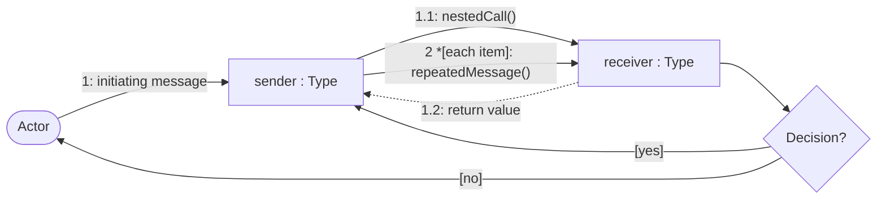

# Communication Diagrams

These UML-style diagrams emphasize which runtime objects collaborate and the numbered messages passed across their links. Mermaid does not provide a native communication-diagram grammar, so flowcharts preserve the communication view's object network and message numbering without implying a vertical timeline.

## Notation

| Visual | Meaning |
| --- | --- |
| Rounded node | Human or platform actor that initiates or receives an interaction. |
| Rectangle | Runtime object instance written as `instance : Type`; external collaborators use the same UML object form. |
| Solid arrow | Call, command, event, or one-way message. |
| Dashed arrow | Return value, result, or callback response. |
| Diamond | Decision that consolidates one incoming result and routes guarded alternatives. |
| `1`, `1.1`, `1.1.1` | Message order and nesting depth. |
| `[condition]` | Guard that must be true for a message to occur. |
| `*[each item]` | Repeated message for a collection or loop. |

## Diagrams

- [Startup and Settings](startup-and-settings.md): Composition, migration, settings loading, and restored GUI state.
- [Path Selection and Validation](path-selection-and-validation.md): Native pickers, bound paths, and immediate validation.
- [Executable Discovery](executable-discovery.md): Concurrent search workers, classification, progress, success, exhaustion, and cancellation.
- [Champollion Execution and Diagnostics](champollion-execution-and-diagnostics.md): Confirmation, validation, structured launch, stream callbacks, summaries, and logs.
- [Output and Desktop Actions](output-and-desktop-actions.md): Output callbacks, auto-scroll, clipboard copy, and Explorer navigation.
- [Help Browser and About Documents](help-and-about.md): Fixed-page navigation, browser history, and packaged legal documents.
- [Unified GUI Workflow](unified-gui-workflow.md): Primary collaboration path from startup through generated-output navigation.

See the [Sequence Diagrams](../sequences/README.md) for the same interactions arranged by time and asynchronous activation.