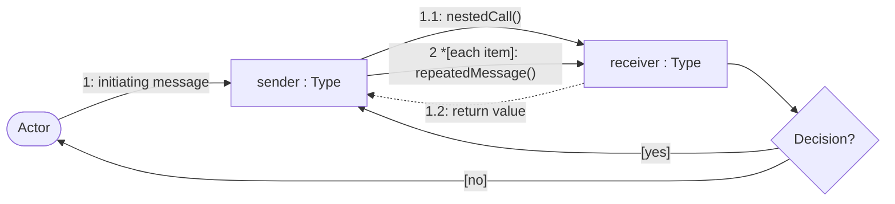
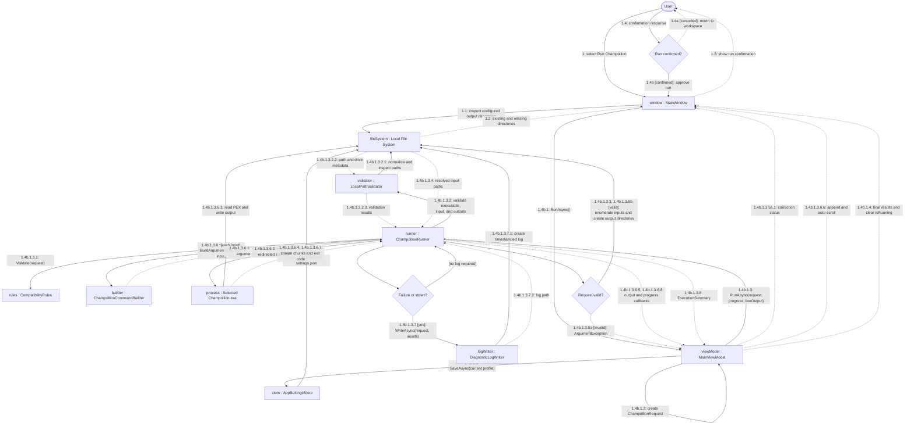

# Champollion Execution and Diagnostics Communication Diagram

## Purpose

This diagram shows the collaborating objects for run confirmation, request validation, structured external-process execution, callbacks, aggregation, and conditional diagnostics.

## Notation

## Diagram

## Collaboration Notes

- `MainWindow` owns the directory-creation confirmation; `ChampollionRunner` remains the authoritative validator before any process starts.
- One process is created for each resolved PEX input, or once for an input-free operation. Structured `ArgumentList` values are returned by `ChampollionCommandBuilder`.
- Stream callbacks may interleave. A file result is finalized only after stdout, stderr, and process exit complete.
- A failed input is retained in the aggregate result without preventing later inputs, and logs are written only for failure or nonempty standard error.