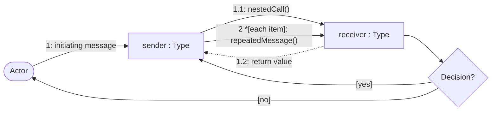
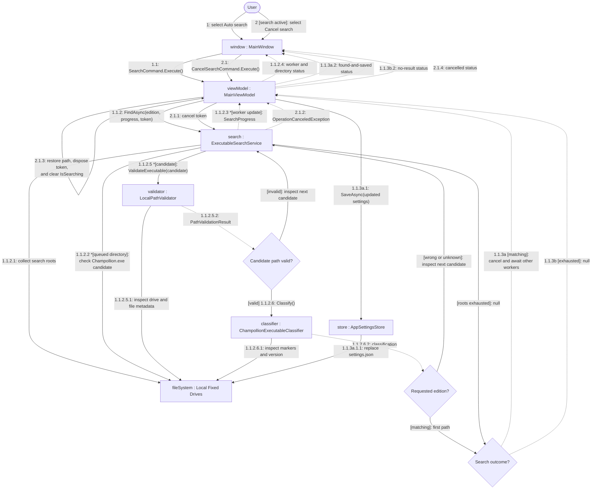

# Executable Discovery Communication Diagram

## Purpose

This diagram shows the collaborating objects used by automatic executable discovery, including progress callbacks and guarded success, exhaustion, and cancellation paths.

## Notation

## Diagram

## Collaboration Notes

- `ExecutableSearchService` owns the bounded worker coordination even though the worker tasks are not drawn as separate public objects.
- The first candidate that is both path-valid and classified for the requested edition wins; other workers are cancelled and awaited.
- Only a successful result is saved. Exhaustion and cancellation restore the previously configured executable path.