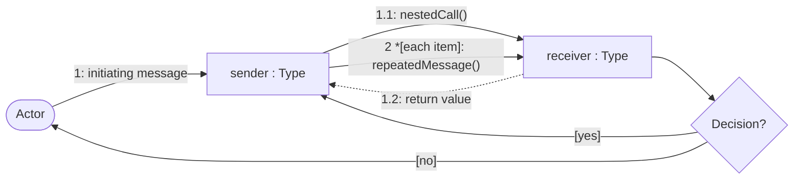
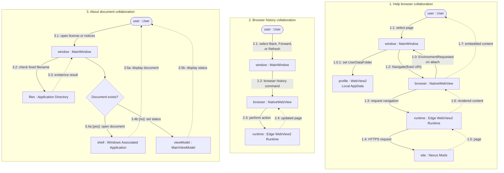

# Help Browser and About Documents Communication Diagram

## Purpose

This diagram shows the object collaborations used for embedded download-page navigation, browser history, and packaged legal-document actions.

## Notation

## Diagram

## Collaboration Notes

- Edition-page actions supply fixed HTTPS locations; browser history actions operate on the page currently held by `NativeWebView`.
- WebView2 and Nexus Mods participate only in Help browsing and do not collaborate with local Champollion execution.
- The browser profile is stored in per-user Local AppData and is removed by the Windows installer during uninstall.
- Legal-document actions use fixed filenames beside the application, check existence, and delegate display to the Windows-associated application.