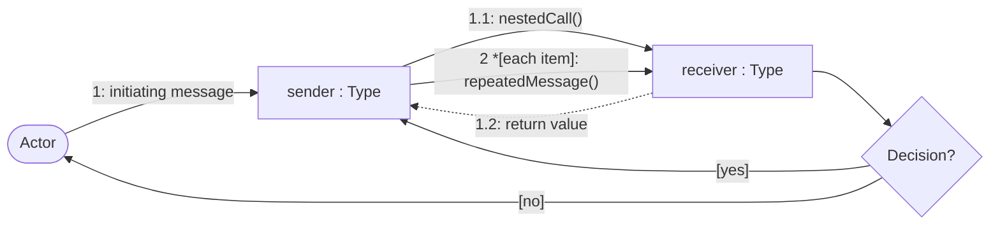

# Output and Desktop Actions Communication Diagram

## Purpose

This diagram shows the object collaborations used to update live output, copy displayed text, and navigate to output, diagnostic, or settings locations.

## Notation

## Diagram

```mermaid
flowchart TB
    subgraph liveOutput["1. Live Output"]
        direction TB
        runner1["runner : ChampollionRunner"]
        viewModel1["viewModel : MainViewModel"]
        window1["window : MainWindow"]
        dispatcher1["dispatcher : Avalonia UI Dispatcher"]

        runner1 -.->|"1 *[stream chunk]: ExecutionOutput"| viewModel1
        viewModel1 -->|"1.1: append OutputText"| viewModel1
        viewModel1 -.->|"1.2: OutputText property changed"| window1
        window1 -->|"1.3: Post(ScrollToEnd)"| dispatcher1
        dispatcher1 -.->|"1.4: scroll live output"| window1
    end

    subgraph copyOutput["2a. Copy Displayed Output"]
        direction TB
        user2a(["User"])
        window2a["window : MainWindow"]
        viewModel2a["viewModel : MainViewModel"]
        clipboard2a["clipboard : Windows Clipboard"]

        user2a -->|"2a: select Copy"| window2a
        window2a -->|"2a.1: read OutputText"| viewModel2a
        viewModel2a -.->|"2a.2: complete displayed output"| window2a
        window2a -->|"2a.3: SetValueAsync(text)"| clipboard2a
    end

    subgraph openOutput["2b. Open Generated Output"]
        direction TB
        user2b(["User"])
        window2b["window : MainWindow"]
        viewModel2b["viewModel : MainViewModel"]
        fileSystem2b["fileSystem : Local File System"]
        outputDecision{"Output directory exists?"}
        explorer2b["explorer : File Explorer"]

        user2b -->|"2b: open source or assembly output"| window2b
        window2b -->|"2b.1: ResolveOutputDirectory(path)"| viewModel2b
        viewModel2b -.->|"2b.2: effective directory or null"| window2b
        window2b -->|"2b.3: Directory.Exists(directory)"| fileSystem2b
        fileSystem2b -.->|"2b.4: existence result"| window2b
        window2b --> outputDecision
        outputDecision -->|"2b.5a [yes]: start(directory argument)"| explorer2b
        outputDecision -->|"2b.5b [no]: set status"| viewModel2b
        viewModel2b -.->|"2b.5b.1: report run is required"| user2b
    end

    subgraph openLog["2c. Open Diagnostic Log"]
        direction TB
        user2c(["User"])
        viewModel2c["viewModel : MainViewModel"]
        explorer2c["explorer : File Explorer"]

        user2c -->|"2c: OpenLogFolderCommand.Execute()"| viewModel2c
        viewModel2c -->|"2c.1: start(/select, LogPath)"| explorer2c
    end

    subgraph openSettings["2d. Open Settings Folder"]
        direction TB
        user2d(["User"])
        viewModel2d["viewModel : MainViewModel"]
        store2d["store : AppSettingsStore"]
        explorer2d["explorer : File Explorer"]

        user2d -->|"2d: OpenSettingsFolderCommand.Execute()"| viewModel2d
        viewModel2d -->|"2d.1: read SettingsDirectory"| store2d
        store2d -.->|"2d.2: UserData directory"| viewModel2d
        viewModel2d -->|"2d.3: start(settings directory)"| explorer2d
    end
```

## Collaboration Notes

- Output callbacks update `MainViewModel`; `MainWindow` reacts to property changes and posts scrolling at background dispatcher priority.
- Repeated object labels across numbered lanes represent the same runtime collaborators; lane-local aliases prevent unrelated workflows from sharing connector routes.
- Clipboard and output-directory actions are view-owned platform interactions.
- Diagnostic-log and settings-folder commands are view-model-owned and launch File Explorer with the stored location.
- Output resolution uses the configured path or the selected executable's working directory when no output path is configured.