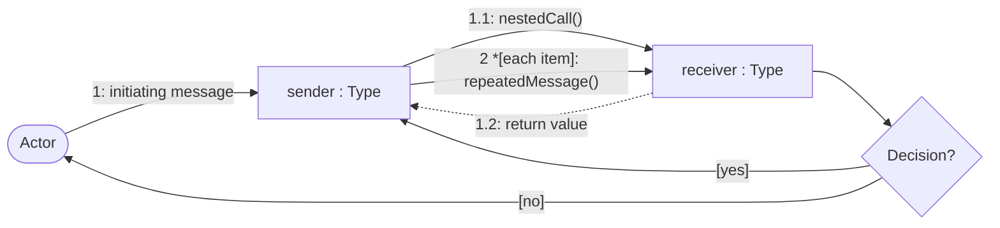
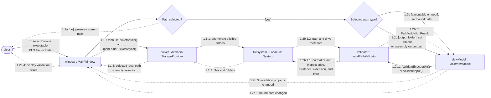

# Path Selection and Validation Communication Diagram

## Purpose

This diagram shows the object collaborations used to browse for executable, input, and output paths and to validate changed executable or PEX input paths.

## Notation

## Diagram

## Collaboration Notes

- Picker filters support selection, but `LocalPathValidator` performs authoritative executable and PEX input validation after the bound value changes.
- Output-folder selection updates `MainViewModel` without immediate validation; `ChampollionRunner` validates outputs before creating directories or launching the CLI.
- Cancellation returns no selected object and leaves the existing bound path unchanged.