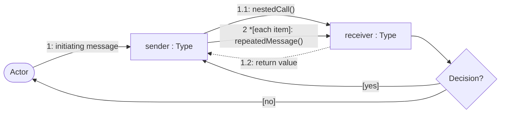

# Startup and Settings Communication Diagram

## Purpose

This diagram shows the object network used to compose the desktop application, migrate legacy data, load settings, and restore initial GUI state.

## Notation

## Diagram

```mermaid
flowchart LR
    user(["User"])
    avalonia["desktop : Avalonia Desktop Lifetime"]
    app["app : App"]
    viewModel["viewModel : MainViewModel"]
    store["store : AppSettingsStore"]
    legacy["legacyData : Legacy LocalAppData"]
    data["userData : Application UserData"]
    window["window : MainWindow"]
    legacyDecision{"Legacy data exists?"}
    loadDecision{"Settings readable?"}

    user -->|"1: launch application"| avalonia
    avalonia -->|"1.1: OnFrameworkInitializationCompleted()"| app
    app -->|"1.1.1: create(validator, runner,<br/>searchService, settingsStore)"| viewModel
    app -->|"1.1.2: create(DataContext = viewModel)"| window
    app -->|"1.1.3: InitializeAsync()"| viewModel
    viewModel -->|"1.1.3.1: LoadAsync()"| store
    store -->|"1.1.3.1.1: inspect settings.json and Logs"| legacy
    legacy -.->|"legacy data presence"| legacyDecision
    legacyDecision -->|"1.1.3.1.2 [yes]:<br/>copy missing files, then remove sources"| data
    legacyDecision -->|"[no]: continue loading"| store
    store -->|"1.1.3.1.3: create UserData and read settings.json"| data
    data -.->|"settings read result"| loadDecision
    loadDecision -->|"1.1.3.1.4 [malformed JSON]:<br/>move to settings.corrupt timestamped backup"| data
    loadDecision -.->|"1.1.3.2 [valid, absent, or I/O]: result"| store
    data -.->|"1.1.3.2 [backup preserved]: fallback result"| store
    store -.->|"1.1.3.3: AppSettings or defaults"| viewModel
    viewModel -.->|"1.1.3.4: restored edition, game,<br/>executable, options, and notifications"| window
    window -.->|"1.2: initialized workspace"| user
```

## Collaboration Notes

- `App` constructs the in-process collaborators and assigns `MainViewModel` as the `MainWindow` data context before initialization continues asynchronously.
- `AppSettingsStore` owns migration, directory creation, JSON loading, corrupt-file preservation, and fallback to default settings.
- Input and output paths are reset from application defaults; they are not returned by persisted settings.