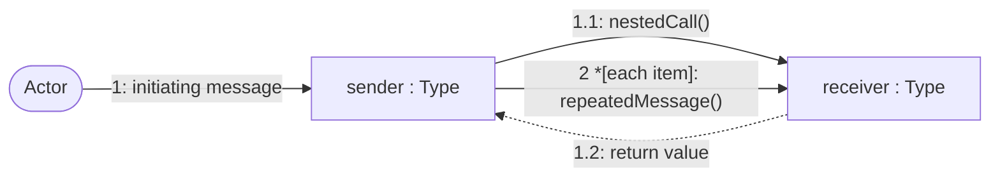

# Unified GUI Workflow Communication Diagram

## Purpose

This diagram combines the principal object collaborations from application startup through a successful decompilation and generated-output navigation.

## Notation

## Diagram

```mermaid
flowchart TB
    subgraph startup["1. Startup and Settings"]
        direction TB
        user1(["User"])
        app1["app : App"]
        viewModel1["viewModel : MainViewModel"]
        window1["window : MainWindow"]
        store1["store : AppSettingsStore"]
        fileSystem1["fileSystem : Local File System"]

        user1 -->|"1: launch application"| app1
        app1 -->|"1.1: create with Application services"| viewModel1
        app1 -->|"1.2: create(DataContext = viewModel)"| window1
        app1 -->|"1.3: InitializeAsync()"| viewModel1
        viewModel1 -->|"1.3.1: LoadAsync()"| store1
        store1 -->|"1.3.1.1: migrate and read settings.json"| fileSystem1
        store1 -.->|"1.3.2: AppSettings"| viewModel1
        viewModel1 -.->|"1.3.3: restored selections"| window1
    end

    subgraph paths["2. Path Selection and Validation"]
        direction TB
        user2(["User"])
        window2["window : MainWindow"]
        viewModel2["viewModel : MainViewModel"]
        validator2["validator : LocalPathValidator"]
        fileSystem2["fileSystem : Local File System"]

        user2 -->|"2: select PEX and output paths"| window2
        window2 -->|"2.1: update bound paths"| viewModel2
        viewModel2 -->|"2.1.1: validate executable and input"| validator2
        validator2 -->|"2.1.1.1: inspect local fixed-drive paths"| fileSystem2
        validator2 -.->|"2.1.2: PathValidationResult"| viewModel2
        viewModel2 -.->|"2.1.3: display path status"| window2
    end

    subgraph runConfirmation["3. Run Champollion - Confirmation"]
        direction TB
        user3a(["User"])
        window3a["window : MainWindow"]
        fileSystem3a["fileSystem : Local File System"]

        user3a -->|"3: select Run Champollion"| window3a
        window3a -->|"3.1: identify missing output directories"| fileSystem3a
        window3a -.->|"3.2: request confirmation"| user3a
        user3a -->|"3.3: confirm"| window3a
    end

    subgraph runSetup["3. Run Champollion - Request Setup"]
        direction TB
        window3b["window : MainWindow"]
        viewModel3b["viewModel : MainViewModel"]
        store3b["store : AppSettingsStore"]
        fileSystem3b["fileSystem : Local File System"]
        runner3b["runner : ChampollionRunner"]

        window3b -->|"3.3.1: RunAsync()"| viewModel3b
        viewModel3b -->|"3.3.1.1: SaveAsync(current profile)"| store3b
        store3b -->|"3.3.1.1.1: replace settings.json"| fileSystem3b
        viewModel3b -->|"3.3.1.2: RunAsync(request, callbacks)"| runner3b
    end

    subgraph runExecution["3. Run Champollion - CLI Execution"]
        direction TB
        runner3c["runner : ChampollionRunner"]
        validator3c["validator : LocalPathValidator"]
        fileSystem3c["fileSystem : Local File System"]
        builder3c["builder : ChampollionCommandBuilder"]
        cli3c["process : Champollion.exe"]
        viewModel3c["viewModel : MainViewModel"]
        window3c["window : MainWindow"]

        runner3c -->|"3.3.1.2.1: validate request paths"| validator3c
        runner3c -->|"3.3.1.2.2: enumerate PEX and<br/>create approved output directories"| fileSystem3c
        runner3c -->|"3.3.1.2.3 *[each input]: BuildArguments()"| builder3c
        builder3c -.->|"3.3.1.2.3.1: ordered argument list"| runner3c
        runner3c -->|"3.3.1.2.3.2: start redirected process"| cli3c
        cli3c -->|"3.3.1.2.3.3: read PEX and write output"| fileSystem3c
        cli3c -.->|"3.3.1.2.3.4: stdout, stderr, and exit code"| runner3c
        runner3c -.->|"3.3.1.2.3.5, 3.3.1.2.4:<br/>callbacks and ExecutionSummary"| viewModel3c
        viewModel3c -.->|"3.3.1.2.3.6, 3.3.1.3:<br/>live output and final results"| window3c
    end

    subgraph generatedOutput["4. Open Generated Output"]
        direction TB
        user4(["User"])
        window4["window : MainWindow"]
        viewModel4["viewModel : MainViewModel"]
        explorer4["explorer : File Explorer"]

        user4 -->|"4: open generated output"| window4
        window4 -->|"4.1: ResolveOutputDirectory()"| viewModel4
        viewModel4 -.->|"4.2: existing output path"| window4
        window4 -->|"4.3: start(directory argument)"| explorer4
        explorer4 -.->|"4.4: display generated files"| user4
    end
```

## Collaboration Notes

- This unified diagram follows the successful primary path. Focused diagrams retain cancellation, invalid-path, search-exhaustion, process-failure, diagnostic-log, and browser alternatives.
- Repeated object labels across numbered lanes represent the same runtime collaborators; lane-local aliases keep independent workflow routes visually separate.
- Numbering shows nesting under each user action; it does not imply that asynchronous callbacks block the UI thread.
- The GUI, Application, and Domain objects collaborate in one desktop process, while Champollion and File Explorer are separate processes.