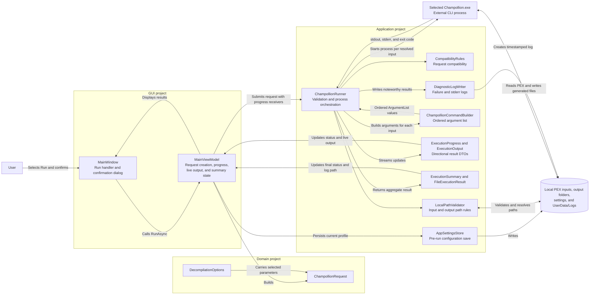

# Champollion Execution and Diagnostics Component Diagram

## Purpose

This diagram follows a confirmed run from GUI selections through request validation and structured command construction to external process output, progress, summaries, and diagnostic logging.

## Key Relationships

- `MainWindow` identifies missing output directories and requires confirmation before calling `MainViewModel.RunAsync`.
- `MainViewModel` persists the active profile, creates the domain request, and translates progress DTOs into bindable status and output text.
- `ChampollionRunner` resolves inputs, validates outputs, creates approved directories, executes every resolved input independently, and drains both redirected streams.
- `DiagnosticLogWriter` writes a log when a process fails or emits noteworthy standard error; one failed input does not prevent remaining inputs from running.