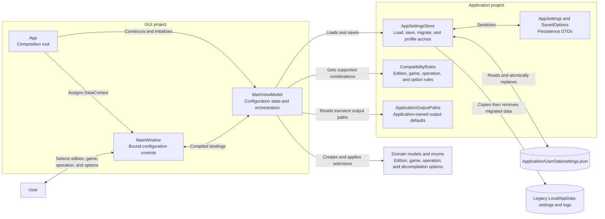

# Configuration and Settings Component Diagram

## Purpose

This diagram shows application startup, saved configuration loading, edition and game profile management, and settings persistence.

## Key Relationships

- `App` constructs one `MainViewModel` and starts `InitializeAsync` after assigning it to `MainWindow`.
- `MainViewModel` keeps executable paths separate by edition and option profiles separate by edition and game.
- `AppSettingsStore` owns JSON persistence and migration. Input and output paths remain transient and are not included in saved settings.
- `CompatibilityRules` controls available games and options; `ApplicationOutputPaths` restores the two application-adjacent output defaults.