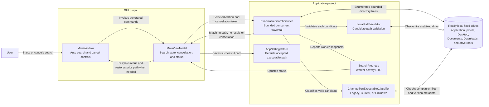

# Executable Discovery Component Diagram

## Purpose

This diagram shows the cancellable GUI workflow that searches local fixed drives and accepts only a `Champollion.exe` matching the selected Legacy or Current edition.

## Key Relationships

- `MainViewModel` owns search cancellation and preserves the previous executable path when search is cancelled or exhausted.
- `ExecutableSearchService` coordinates the bounded worker swarm and excludes unsupported or intentionally skipped directory trees.
- `LocalPathValidator` establishes whether a candidate is an eligible local executable before classification.
- `ChampollionExecutableClassifier` requires the complete Legacy companion layout; standalone valid executables classify as Current, while partial Legacy layouts remain Unknown.