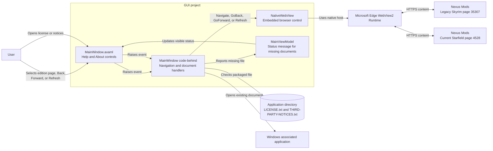

# Help Browser and About Documents Component Diagram

## Purpose

This diagram shows the Help tab's embedded download browser and the About tab's packaged legal-document actions. These features do not participate in local Champollion execution.

## Key Relationships

- `MainWindow.axaml` owns the `NativeWebView`; code-behind supplies the fixed Legacy and Current Nexus Mods URIs and navigation actions.
- `Avalonia.Controls.WebView` uses the separately supplied WebView2 Runtime on Windows.
- The About actions resolve legal documents beside the running application and ask Windows to open them with the associated application.
- Browser availability and legal-document actions are independent of the local `Champollion.exe` execution workflow.