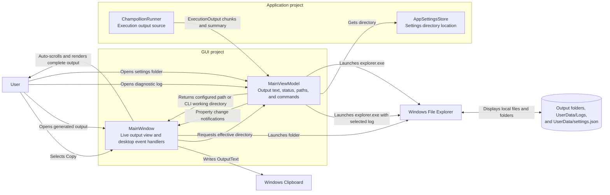

# Output and Desktop Actions Component Diagram

## Purpose

This diagram shows how execution output reaches the workspace and how users copy text or navigate to output, log, and settings locations through Windows desktop services.

## Key Relationships

- `MainViewModel` accumulates complete standard output and prefixed standard-error chunks while retaining progress and final per-input statuses.
- `MainWindow` listens for output property changes and posts automatic scrolling to the Avalonia UI thread.
- Clipboard and output-folder actions remain view-specific platform interactions.
- Generated `OpenLogFolderCommand` and `OpenSettingsFolderCommand` launch File Explorer from `MainViewModel` using locations supplied by execution results and `AppSettingsStore`.