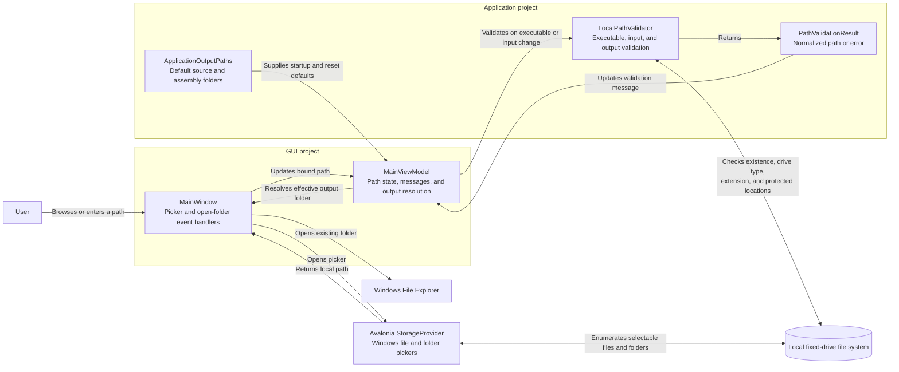

# Path Selection and Validation Component Diagram

## Purpose

This diagram shows how executable, PEX input, and output paths move from native Windows pickers through GUI state into Application-owned validation and normalization.

## Key Relationships

- `MainWindow` owns platform picker and File Explorer interactions; it passes selected local paths to `MainViewModel`.
- `MainViewModel` validates executable and input paths as they change and displays the returned message.
- `LocalPathValidator` expands environment variables, normalizes full paths, requires local fixed drives, and applies executable, input, and output-specific rules.
- Output paths receive full validation again in `ChampollionRunner` before directories are created and execution begins.