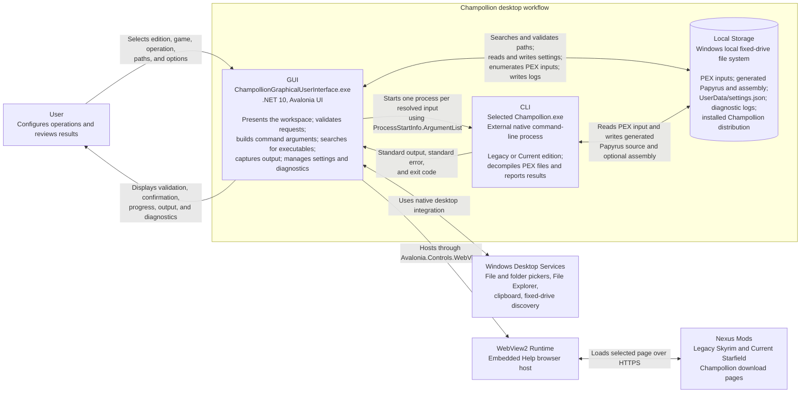

# Container Diagram

## Purpose

This diagram expands the desktop workflow into its runtime containers. It shows the GUI process, the selected external Champollion command-line process, and their shared use of local fixed-drive storage. The Legacy and Current executables have the same container relationship even though their distributions and supported options differ.

## Container Responsibilities

| Container | Ownership | Responsibilities |
| --- | --- | --- |
| GUI | This repository | Hosts the Avalonia interface and the in-process UI, Application, and Domain code. It validates local paths and compatibility, persists configuration, searches fixed drives, creates output directories, starts the CLI, captures both process streams, and presents progress and results. |
| CLI | External third-party distribution | Runs the selected Legacy or Current `Champollion.exe`. It receives structured command arguments, reads each selected `.pex` input, writes requested decompilation output, and returns standard output, standard error, and an exit code. It is not shipped with this application. |
| Local Storage | User's Windows machine | Stores `.pex` inputs, the selected Champollion distribution, generated Papyrus source and optional assembly, application-adjacent `UserData/settings.json`, corrupt-settings backups, and diagnostic logs. Supported application paths must resolve to local fixed drives. |

## Runtime Notes

- The GUI, Application, and Domain projects compile into the GUI process; they are internal code boundaries rather than separately deployed containers.
- A CLI process is created for each resolved input. Input-free Help and Version operations create one process without a PEX argument.
- The GUI redirects and drains standard output and standard error, waits for process exit, and uses the exit code as the success signal.
- Output directories are created by the GUI after validation and user confirmation. The CLI writes the requested generated files to those locations.
- WebView2 and Nexus Mods support the embedded Help download browser only. They are not required for local Champollion execution.