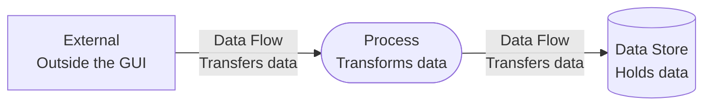

# Data Flow Diagrams

These diagrams describe data entering, leaving, moving through, and persisting around the GUI. They distinguish external entities, GUI processes, and data stores rather than call order or deployment location.

## Notation

| Shape | Meaning |
| --- | --- |
| Rectangle | External person, process, website, or platform service. |
| Rounded rectangle | A process performed by the GUI or its in-process Application services. |
| Cylinder | A persistent, file-backed, or explicitly modeled in-memory data store. |
| Labeled arrow | The data transferred between entities, processes, or stores. |

## Diagrams

- [Level 0 GUI Data Flow](level-0-gui-data-flow.md): The whole GUI as one process and its external exchanges.
- [Unified Level 1 GUI Data Flow](unified-level-1-gui-data-flow.md): Major GUI processes, stores, and external entities in one decomposed view.
- [Configuration and Settings](configuration-and-settings.md): Persisted profiles, migration, and transient selections.
- [Path Validation and Executable Discovery](path-validation-and-executable-discovery.md): User paths, filesystem metadata, normalized paths, progress, and executable classification.
- [Execution and Diagnostics](execution-and-diagnostics.md): Requests, PEX inputs, CLI arguments, generated files, stream output, summaries, and logs.
- [Desktop, Help, and About](desktop-help-and-about.md): Clipboard, File Explorer, legal documents, WebView2, and Nexus Mods content.

See the [Sequence Diagrams](../sequences/README.md) when interaction order is more important than data ownership.