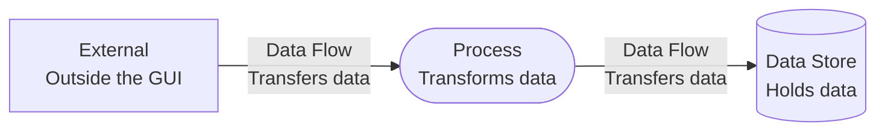
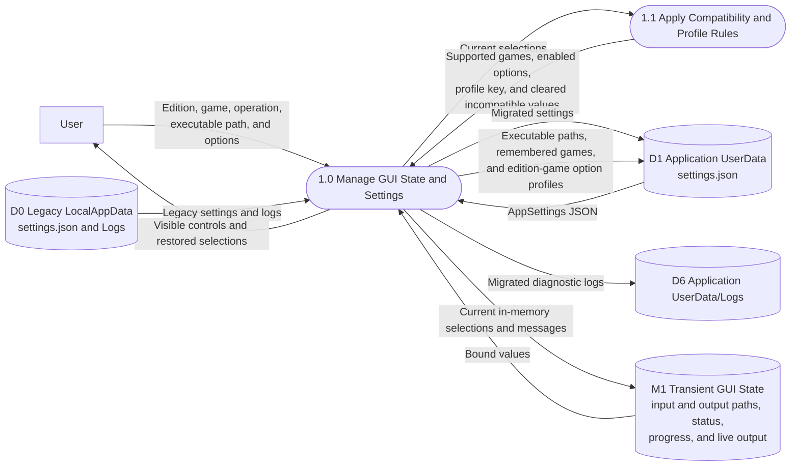

# Configuration and Settings Data Flow Diagram

## Purpose

This DFD shows how GUI selections become saved edition and game profiles, how settings return at startup, and which paths remain transient.

## Legend

## Diagram

## Persisted Data

- `LegacyExecutablePath` and `CurrentExecutablePath`.
- `LastLegacyGame` and `LastCurrentGame`.
- `EditionGameOptions`, keyed by explicit edition and game combinations.
- Saved options include assembly, comments, recursion, recreated subdirectories, header, trace, tree suppression, debug functions, debug-line suppression, and verbose output.

## Transient Data

Input path, source-output path, assembly-output path, current status, search state, run progress, live process output, and the latest log path remain in memory and are not serialized into `settings.json`.