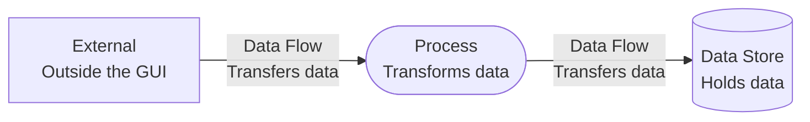
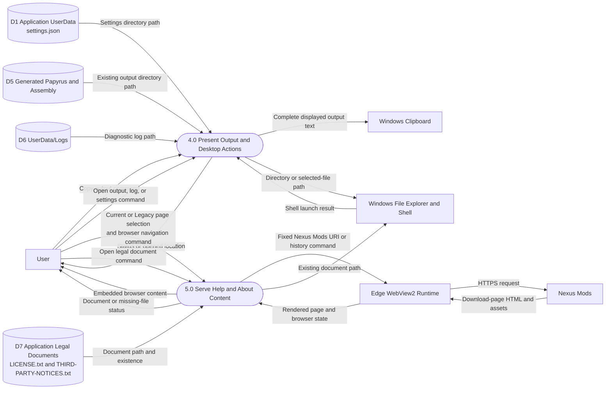

# Desktop, Help, and About Data Flow Diagram

## Purpose

This DFD shows data exchanged with Windows desktop services, the embedded browser, Nexus Mods, and packaged legal documents outside the core execution flow.

## Legend

## Diagram

## Data Boundaries

- Clipboard receives the complete in-memory output text; the GUI does not read clipboard contents back.
- File Explorer and the Windows shell receive local paths only. They do not return file contents to the GUI.
- WebView2 exchanges selected URIs and browser state with the GUI and obtains page content from Nexus Mods over HTTPS.
- Legal documents are packaged application files. Missing files produce a GUI status message rather than execution failure.