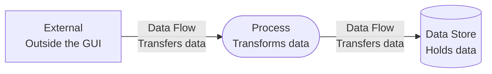
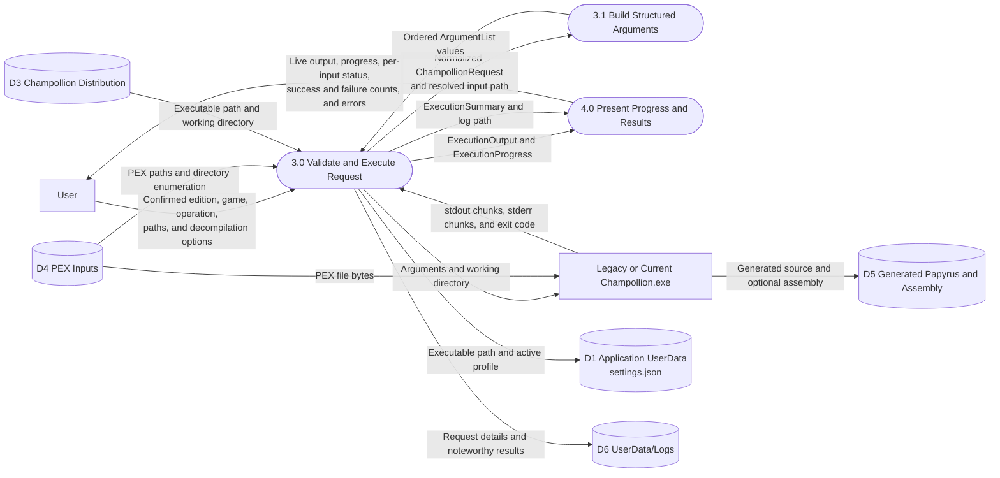

# Execution and Diagnostics Data Flow Diagram

## Purpose

This DFD shows how transient GUI selections become a validated request, how each PEX input crosses the external CLI boundary, and how output, progress, summaries, generated files, and diagnostics return.

## Legend

## Diagram

## Data Contracts

- `ChampollionRequest` carries edition, game, operation, executable path, optional input path, and `DecompilationOptions`.
- `ExecutionOutput` carries input path, stream classification, and a text chunk.
- `ExecutionProgress` carries completed count, total count, and current input.
- `FileExecutionResult` retains input path, exit code, complete standard output, complete standard error, and success.
- `ExecutionSummary` returns all file results, optional log path, and successful and failed counts.
- Diagnostic logs persist edition, game, operation, each input, exit code, and complete process streams.