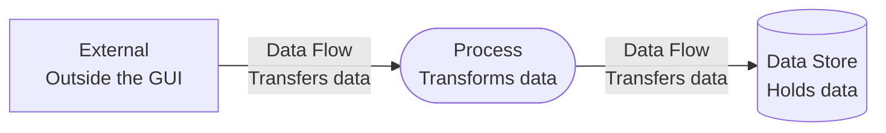
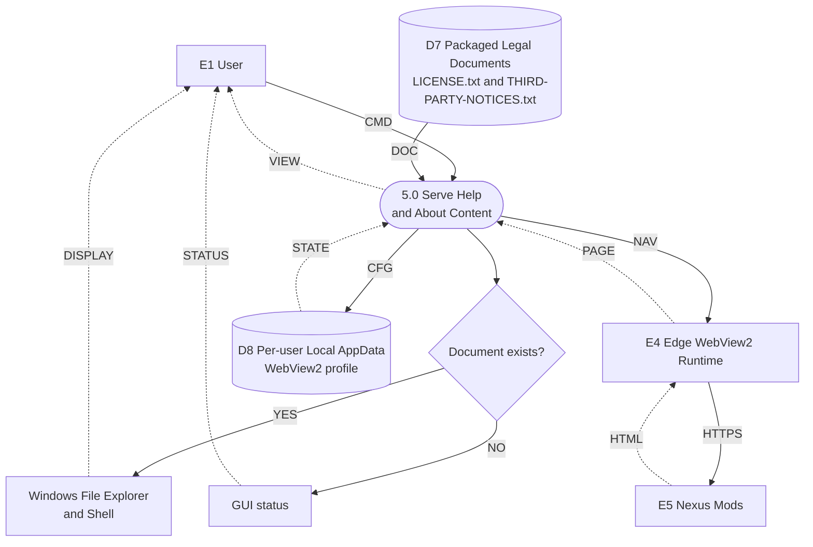

# Help and About Data Flow Diagram

## Purpose

This DFD details process `5.0 Serve Help and About Content`, including embedded Help browsing, Nexus Mods content, the per-user WebView2 profile, and packaged legal documents.

## Legend

## Diagram

## Flow Key

| Code | Data exchanged |
| --- | --- |
| `CMD` | Help navigation, browser navigation, or legal-document command |
| `DOC` | Document path and existence information |
| `YES` / `NO` | Existing document path or missing-file status branch |
| `DISPLAY` / `STATUS` | Displayed legal document or GUI status |
| `NAV` | Current or Legacy page selection or browser navigation |
| `HTTPS` / `HTML` / `PAGE` | HTTPS request, download-page HTML/assets, or rendered page content |
| `CFG` / `STATE` | WebView2 profile configuration or cookies and browser state |
| `VIEW` | Embedded browser content returned to the user |

## Data Boundaries

- Process `5.0` handles Help navigation and About/legal document commands.
- Legal documents are packaged application files. Missing files produce a GUI status message rather than execution failure.
- WebView2 exchanges selected page navigation and browser state with the GUI and obtains page content from Nexus Mods over HTTPS.
- The browser profile is stored in per-user Local AppData; Windows uninstall removes the application-specific profile.
