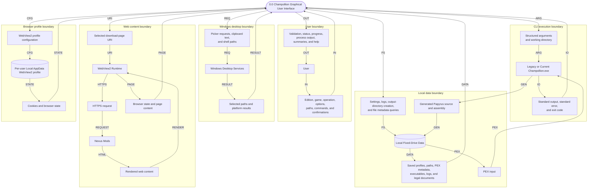

# Level 0 GUI Data Flow Diagram

## Purpose

This context-level DFD treats Champollion Graphical User Interface as one process and shows the data crossing its boundary.

## Legend

## Diagram

## Flow Key

| Code | Data exchanged |
| --- | --- |
| `IN` / `OUT` | User selections and confirmations, or GUI validation, status, progress, output, summaries, and help |
| `ARG` / `IO` | Structured CLI arguments and working directory, or standard output, standard error, and exit code |
| `FS` / `DATA` | Local settings/log/output-directory operations, or saved profiles, paths, metadata, executables, logs, and legal documents |
| `PEX` / `GEN` | PEX input, or generated Papyrus source and assembly |
| `REQ` / `RESULT` | Windows picker, clipboard, and shell requests, or selected paths and platform results |
| `URI` / `HTTPS` / `REQUEST` | Selected download-page URI, HTTPS request, or request sent to Nexus Mods |
| `HTML` / `RENDER` / `PAGE` | Rendered web content, rendering exchange, or browser state and page content |
| `CFG` / `STATE` | WebView2 profile configuration, or cookies and browser state |

## Boundary Rules

- Input and output paths remain transient GUI data and are not written to settings.
- The external CLI reads PEX files and writes generated output directly on the local file system.
- The GUI captures CLI streams and the exit code, then persists diagnostic data only for failures or noteworthy standard error.
- Web content is isolated to the embedded Help browser and does not enter the local execution request.
- WebView2 browser state is stored under per-user Local AppData and is removed by Windows uninstall.