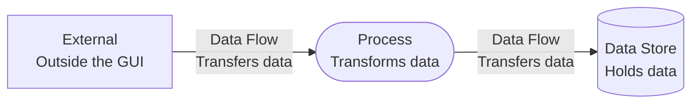
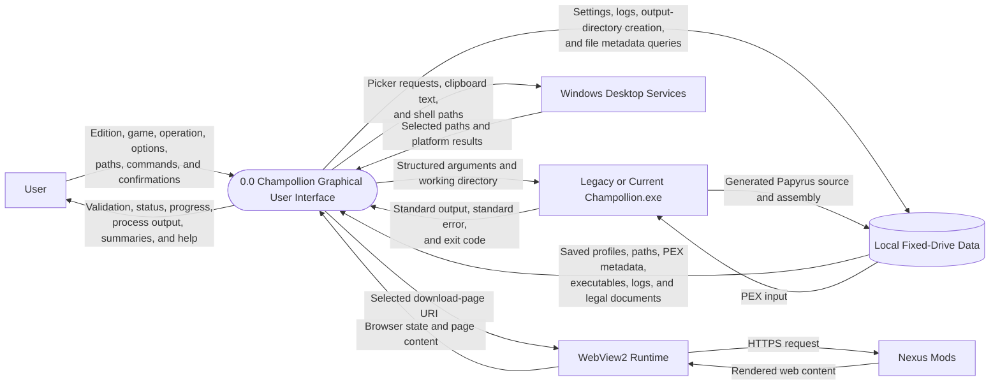

# Level 0 GUI Data Flow Diagram

## Purpose

This context-level DFD treats Champollion Graphical User Interface as one process and shows the data crossing its boundary.

## Legend

## Diagram

## Boundary Rules

- Input and output paths remain transient GUI data and are not written to settings.
- The external CLI reads PEX files and writes generated output directly on the local file system.
- The GUI captures CLI streams and the exit code, then persists diagnostic data only for failures or noteworthy standard error.
- Web content is isolated to the embedded Help browser and does not enter the local execution request.