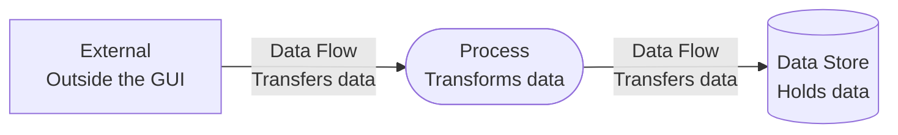
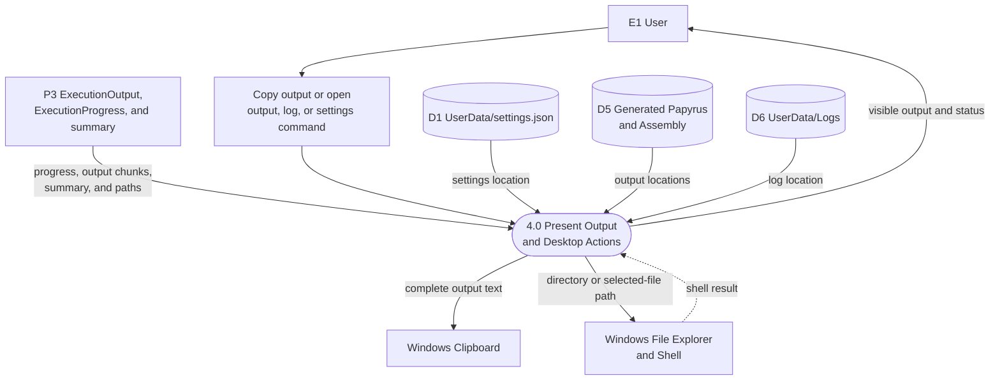

# Output and Desktop Actions Data Flow Diagram

## Purpose

This DFD details process `4.0 Present Output and Desktop Actions`, including output presentation, copy-to-clipboard, and opening generated output, logs, and settings through Windows desktop services.

## Legend

## Diagram

## Data Boundaries

- Process `4.0` receives transient execution progress, output chunks, summaries, and paths from process `3.0`.
- The clipboard receives complete in-memory output text; the GUI does not read clipboard contents back.
- File Explorer and the Windows shell receive local paths only and do not return file contents to the GUI.
- Settings, generated output, and diagnostic logs provide locations for desktop actions.
