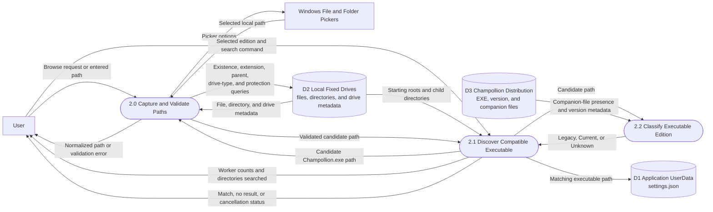

# Path Validation and Executable Discovery Data Flow Diagram

## Purpose

This DFD shows how entered or selected paths are normalized and validated, and how automatic discovery converts filesystem metadata into a matching executable path and progress data.

## Legend

## Diagram

## Data Rules

- Validation returns `PathValidationResult`: validity, normalized absolute path, and an error when invalid.
- Search progress contains directories searched, active workers, and configured worker count.
- Search reads only ready local fixed-drive trees and skips unsupported or excluded locations.
- Classification consumes distribution metadata, not executable contents. A complete companion layout identifies Legacy; a valid standalone distribution identifies Current; ambiguous partial layouts remain Unknown.
- Only a successful matching executable path is saved. Cancellation or exhaustion restores the previous path.