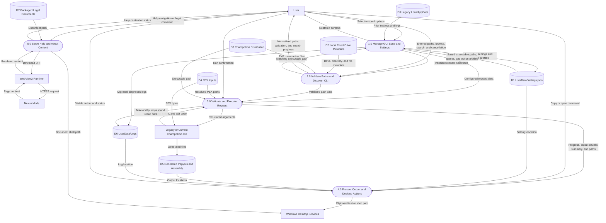

# Unified Level 1 GUI Data Flow Diagram

## Purpose

This Level 1 DFD decomposes the GUI into its five major data-processing responsibilities and shows their shared stores and external boundaries.

## Legend

## Diagram

## Level 1 Scope

- Processes `1.0` through `5.0` are logical responsibilities inside the single GUI executable, not separately deployed services.
- `D0` is migration input only. Current settings and logs live beside the application under `UserData`.
- `D2` represents metadata read during validation and traversal; `D3` represents the selected third-party executable distribution.
- `D4` and `D5` remain separate because PEX inputs are read while Papyrus source and optional assembly are generated.
- Transient paths, status, progress, output text, and the latest log path move between GUI processes in memory and are not persistent stores.