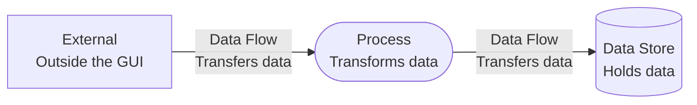
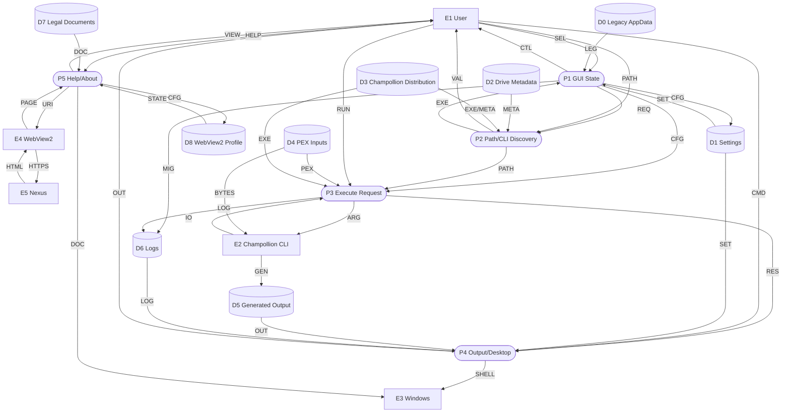

# Unified Level 1 GUI Data Flow Diagram

## Purpose

This Level 1 DFD decomposes the GUI into its five major data-processing responsibilities and shows their shared stores and external boundaries.

## Legend

## Diagram

## Unified Flow Key

| Code | Data exchanged |
| --- | --- |
| `SEL` | Edition, game, operation, options, paths, commands, and confirmations |
| `CFG` | Current profiles, configured request data, or WebView2 profile configuration |
| `REQ` / `PATH` | Transient request selections or validated path data |
| `EXE` / `ARG` | Executable paths or structured CLI arguments |
| `PEX` / `BYTES` / `GEN` | Resolved PEX paths, PEX bytes, or generated files |
| `IO` / `RES` / `LOG` | CLI streams and exit code, execution results, or diagnostic data |
| `OUT` / `CMD` / `SHELL` | Presented output, desktop commands, or Windows shell paths |
| `HELP` / `DOC` / `VIEW` | Help or legal commands, document paths, or Help content/status |
| `URI` / `HTTPS` / `HTML` / `PAGE` | Download URI, request, page content, or rendered content |
| `STATE` | Cookies and browser state |

## Process Traceability

| Unified ID | Detailed diagram | Detailed subprocesses |
| --- | --- | --- |
| `P1` | [configuration-and-settings.md](configuration-and-settings.md) | `1.0`, `1.1` |
| `P2` | [path-validation-and-executable-discovery.md](path-validation-and-executable-discovery.md) | `2.0`, `2.1`, `2.2` |
| `P3` | [execution-and-diagnostics.md](execution-and-diagnostics.md) | `3.0`, `3.1` |
| `P4` | [output-and-desktop-actions.md](output-and-desktop-actions.md) | `4.0` |
| `P5` | [help-and-about.md](help-and-about.md) | `5.0` |

## Level 1 Scope

- Processes `1.0` through `5.0` are logical responsibilities inside the single GUI executable, not separately deployed services.
- `D0` is migration input only. Current settings and logs live beside the application under `UserData`.
- `D2` represents metadata read during validation and traversal; `D3` represents the selected third-party executable distribution.
- `D4` and `D5` remain separate because PEX inputs are read while Papyrus source and optional assembly are generated.
- Transient paths, status, progress, output text, and the latest log path move between GUI processes in memory and are not persistent stores.