# GitHub and Mod Website Deployment Diagram

## Purpose

This diagram extends the GitHub deployment with the manual distribution path used to publish the portable ZIP to mod-hosting websites such as GameFront or Nexus Mods. The current workflow has no credentials, jobs, or API integration for either external site.

```mermaid
flowchart LR
    subgraph github["GitHub"]
        repository[("Tagged repository source")]

        subgraph actions["GitHub Actions"]
            windowsRunner["windows-latest runner<br/>Build, test, and run<br/>package-windows.ps1"]
            artifactStore[("windows-x64 workflow artifact")]
            releaseRunner["ubuntu-latest release runner<br/>Download artifacts and run GitHub CLI"]
        end

        release[("GitHub Release<br/>Portable ZIP, setup EXE,<br/>and SHA-256 files")]
    end

    subgraph maintainerDevice["Maintainer Windows workstation<br/>&lt;&lt;device&gt;&gt;"]
        download["Download release assets<br/>or the windows-x64 artifact bundle"]
        extract["Extract GitHub artifact wrapper<br/>when downloading a workflow artifact"]
        verify["Verify SHA-256 checksum<br/>and inspect archive contents"]
        stage[("ChampollionGraphicalUserInterface-<br/>&lt;version&gt;-win-x64-portable.zip<br/>&lt;&lt;deployment artifact&gt;&gt;")]
        metadata["Prepare site metadata<br/>Version, description, changelog,<br/>requirements, and screenshots"]
    end

    subgraph modSites["External mod websites"]
        gameFront[("GameFront<br/>&lt;&lt;manual deployment destination&gt;&gt;")]
        nexusMods[("Nexus Mods<br/>&lt;&lt;manual deployment destination&gt;&gt;")]
    end

    consumers["Mod-site users<br/>&lt;&lt;devices&gt;&gt;"]

    repository --> windowsRunner
    windowsRunner -->|"Produces portable ZIP,<br/>installer, and checksums"| artifactStore
    artifactStore --> releaseRunner
    releaseRunner --> release

    artifactStore -.->|"Manual artifact download"| download
    release -->|"Preferred public asset download"| download
    download --> extract
    extract --> verify
    verify -->|"Select existing portable ZIP"| stage
    metadata --> gameFront
    metadata --> nexusMods
    stage -->|"Manual browser upload"| gameFront
    stage -->|"Manual browser upload"| nexusMods
    gameFront -->|"Download"| consumers
    nexusMods -->|"Download"| consumers
```

## Manual Distribution Rules

- The portable ZIP is created by `scripts/package-windows.ps1` on the Windows runner before upload to GitHub. Downloading a workflow artifact may add a GitHub artifact wrapper that must be extracted, but the inner portable ZIP should not be recompressed.
- Prefer the tagged GitHub Release asset for public mod-site publication because it is versioned and accompanied by its generated checksum. A retained workflow artifact is an alternate source when authorized by the release process.
- Verify the `.sha256` file and inspect the portable ZIP before upload. Confirm that it contains the self-contained GUI distribution and does not contain any third-party `Champollion.exe`.
- Upload the portable ZIP, not the Inno Setup installer, unless a mod website explicitly supports installer distribution and the release owner chooses that channel.
- GameFront and Nexus Mods publication is manual. Site authentication, page ownership, descriptions, screenshots, changelogs, and release visibility remain outside GitHub Actions.
- Keep the mod-site version and release notes aligned with the Git tag and GitHub Release. Rebuilding or recompressing the same version would invalidate the published checksum and create artifacts with different bytes.