# GitHub-Only Deployment Diagram

## Purpose

This diagram shows the deployment nodes used by `.github/workflows/build-release.yml` when source changes are validated and Windows artifacts are produced. A `v*` tag extends the normal build path by publishing the downloaded workflow artifacts to a GitHub Release.

```mermaid
flowchart LR
    developer["Developer workstation<br/>&lt;&lt;device&gt;&gt;"]

    subgraph github["GitHub"]
        repository[("Repository<br/>&lt;&lt;source&gt;&gt;")]

        subgraph actions["GitHub Actions"]
            subgraph windowsRunner["windows-latest runner<br/>&lt;&lt;execution environment&gt;&gt;"]
                checkout["actions/checkout@v4"]
                dotnet["actions/setup-dotnet@v4"]
                restoreTest["Restore and Release tests"]
                inno["Inno Setup"]
                packageScript["scripts/package-windows.ps1"]
                publishOutput[("Self-contained win-x64 publish output")]
                packageOutput[("artifacts/packages")]
            end

            artifactStore[("GitHub Actions artifact<br/>windows-x64<br/>&lt;&lt;artifact store&gt;&gt;")]

            subgraph releaseRunner["ubuntu-latest release runner<br/>&lt;&lt;execution environment&gt;&gt;"]
                download["actions/download-artifact@v4<br/>merge-multiple: true"]
                ghCli["GitHub CLI<br/>create release or upload to existing release"]
            end
        end

        release[("GitHub Release<br/>&lt;&lt;deployment destination&gt;&gt;")]
    end

    user["Release consumer<br/>&lt;&lt;device&gt;&gt;"]

    developer -->|"Push, pull request, or v* tag"| repository
    repository --> checkout
    checkout --> dotnet
    dotnet --> restoreTest
    restoreTest --> inno
    inno --> packageScript
    packageScript -->|"dotnet publish -r win-x64<br/>self-contained"| publishOutput
    publishOutput -->|"Rejects bundled Champollion.exe<br/>then packages"| packageOutput
    packageOutput -->|"Portable ZIP, setup EXE,<br/>and SHA-256 files"| artifactStore

    artifactStore -->|"Tag builds only"| download
    download --> ghCli
    ghCli -->|"GH_TOKEN and GH_REPO"| release
    release -->|"Downloads release assets"| user
```

## Deployment Behavior

- Pushes to `main` and pull requests build, test, package, and retain the `windows-x64` workflow artifact. They do not run the release job.
- A `v*` tag supplies the package version without its leading `v` and enables the `ubuntu-latest` release job after the Windows job succeeds.
- The Windows packaging script creates a self-contained portable ZIP, an Inno Setup installer, and a `.sha256` file for each package. CI installs Inno Setup, so the installer is expected there.
- `actions/upload-artifact` uploads files matching `artifacts/packages/*-win-x64-*` into the `windows-x64` artifact.
- The release runner downloads and merges artifacts into `artifacts`, then uses `gh release create`. If the release already exists, it uploads and replaces its assets instead.
- Neither the workflow artifact nor the GitHub Release may contain the external third-party `Champollion.exe`.