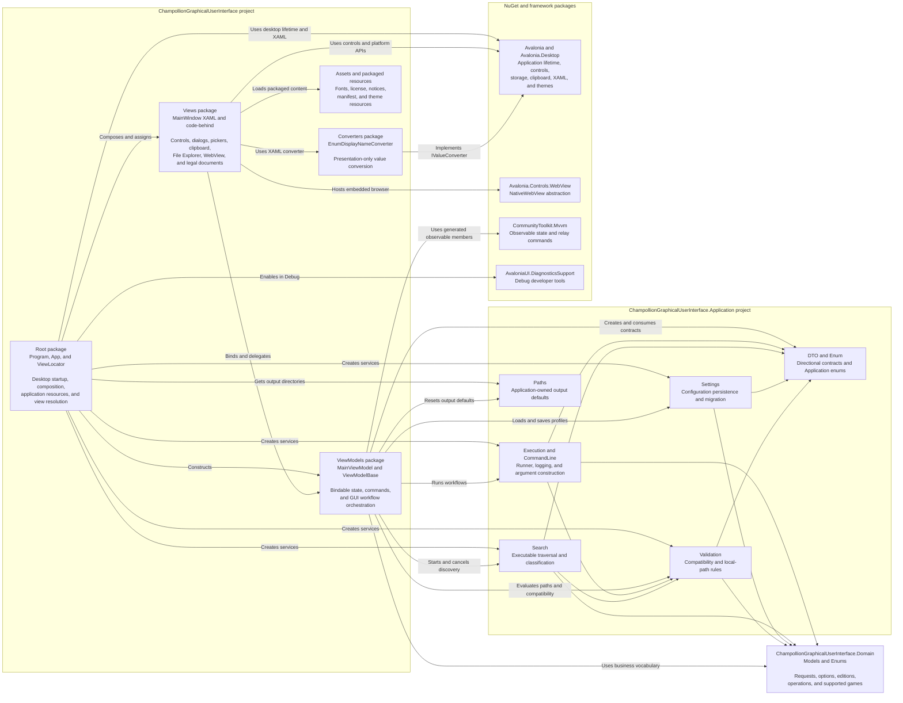

# GUI Package Diagram

## Purpose

This diagram shows the compile-time package and namespace dependencies of the `ChampollionGraphicalUserInterface` desktop project. Unlike the component diagrams, its arrows mean "imports or references" rather than runtime control or data flow.

See the [Summary GUI Package Diagram](summary-gui-package-diagram.md) for the same project boundary with internal packages collapsed.

## Package Responsibilities

| Package | Responsibility |
| --- | --- |
| Root | Starts Avalonia, constructs Application services and `MainViewModel`, creates `MainWindow`, registers application resources, and resolves view models to views. |
| `Views` | Owns Avalonia controls and platform-specific presentation interactions. It delegates workflow state and Application calls through `MainViewModel`. |
| `ViewModels` | Owns bindable GUI state, commands, selection transitions, and workflow orchestration. It is the primary GUI consumer of Application and Domain. |
| `Converters` | Contains presentation-only conversion used by XAML bindings. |
| Assets and packaged resources | Supplies static application resources and files copied to build or publish output; it is not a C# namespace. |

## Dependency Rules

- The GUI project references both Application and Domain. Application references Domain; Domain has no project dependencies.
- `Views` depends on `ViewModels`, but view models do not depend on views or Avalonia controls.
- Platform-specific pickers, clipboard, WebView, dialogs, and shell behavior remain in `Views` or the GUI root package.
- Validation, persistence, executable search, command construction, process execution, and diagnostic logging remain in Application packages.
- The physical `Models` folder currently declared by the GUI project is empty, so it is not shown as a logical package.