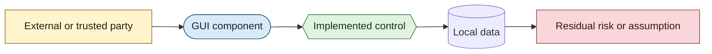

# Security Diagrams

These diagrams describe the GUI's security boundaries, implemented controls, and residual trust assumptions. They document current behavior; a control shown as absent is not implied to exist elsewhere.

## Notation

| Visual | Meaning |
| --- | --- |
| Amber rectangle | External party, runtime, process, or trust assumption. |
| Blue rounded node | Component inside the GUI application boundary. |
| Green hexagon | Security-relevant control implemented by the repository. |
| Cylinder | Persistent or file-backed local data. |
| Red rectangle | Residual risk, missing control, or operational assumption. |
| Dashed subgraph | Trust boundary crossed by data or execution. |

## Diagrams

- [Security Context and Trust Boundaries](security-context-and-trust-boundaries.md): System-wide attack surfaces and trust zones.
- [Local Execution and Filesystem Security](local-execution-and-filesystem-security.md): Path validation, command construction, CLI launch, and output creation.
- [Settings, Logs, and Local Data Security](settings-logs-and-local-data-security.md): Plaintext persistence, migration, corruption handling, and diagnostic exposure.
- [WebView2 and Desktop Integration Security](webview-and-desktop-integration-security.md): Embedded web content, clipboard, File Explorer, and shell handoffs.
- [Build and Release Supply-Chain Security](build-and-release-supply-chain-security.md): CI permissions, packaging checks, checksums, publication, and provenance gaps.
- [Unified Security Controls](unified-security-controls.md): One view of the principal runtime and delivery controls and residual risks.

These views complement the [Data Flow Diagrams](../data-flows/README.md), which describe the data being transferred without classifying its security significance.