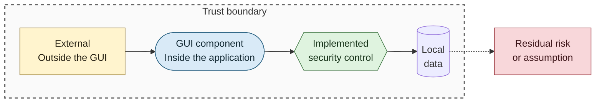

# Build and Release Supply-Chain Security

## Purpose

This diagram shows repository-controlled release safeguards, third-party build dependencies, publication boundaries, and provenance controls that are not currently present.

## Notation

See the [security diagram notation table](README.md#notation) for additional detail.

## Diagram

```mermaid
flowchart LR
    maintainer["Maintainer"]:::external
    source[("GitHub repository and v* tag")]

    subgraph actionsBoundary["GitHub Actions hosted-runner boundary"]
        checkout["actions/checkout@v4"]:::external
        setup["actions/setup-dotnet@v4"]:::external
        restore(["NuGet restore"]):::component
        tests{{"Release solution tests must pass"}}:::control
        chocolatey["Chocolatey and Inno Setup package"]:::external
        packaging(["package-windows.ps1"]):::component
        exclusion{{"Fail if Champollion.exe appears<br/>in publish output"}}:::control
        hashes{{"Generate SHA-256 file<br/>for each package"}}:::control
        artifact[("windows-x64 workflow artifact")]
    end

    subgraph publicationBoundary["Release publication boundary"]
        release{{"Tag-only job; contents: write;<br/>gh release --verify-tag"}}:::control
        github[("GitHub Release assets")]
        workstation["Maintainer workstation"]:::external
        verify{{"Manual checksum and archive inspection"}}:::control
        modSites[("Nexus Mods or GameFront assets")]
    end

    consumer["Release consumer"]:::external

    maintainer -->|"Reviewed source and tag"| source
    source --> checkout --> setup --> restore --> tests
    chocolatey --> packaging
    tests --> packaging --> exclusion --> hashes --> artifact
    artifact --> release --> github
    github --> workstation --> verify --> modSites
    github --> consumer
    modSites --> consumer

    pinRisk["Actions use mutable major tags;<br/>Inno Setup install is not version-pinned"]:::risk
    provenanceRisk["No code signing, artifact attestation,<br/>SBOM, or signed provenance"]:::risk
    checksumRisk["Checksums detect changed bytes but do not<br/>authenticate a publisher when co-hosted"]:::risk
    manualRisk["Mod-site identity, upload, and metadata<br/>remain manual operational controls"]:::risk

    checkout -.-> pinRisk
    chocolatey -.-> pinRisk
    artifact -.-> provenanceRisk
    hashes -.-> checksumRisk
    modSites -.-> manualRisk

    classDef external fill:#fff4ce,stroke:#8a6d1d,color:#241f12
    classDef component fill:#d9eaf7,stroke:#286182,color:#102630
    classDef control fill:#dff3df,stroke:#39733d,color:#173319
    classDef risk fill:#f8d7da,stroke:#9b3a42,color:#3d1519
    style actionsBoundary fill:#f5f9fc,stroke:#286182,stroke-width:2px,stroke-dasharray:5 5
    style publicationBoundary fill:#fffaf0,stroke:#8a6d1d,stroke-width:2px,stroke-dasharray:5 5
```

## Implemented Controls

- Workflow permissions default to `contents: read`; only the tag-gated release job receives `contents: write`.
- The Windows job restores and tests the solution before packaging a self-contained `win-x64` distribution.
- Packaging fails if any third-party `Champollion.exe` is found in publish output.
- Portable ZIP and installer artifacts receive adjacent SHA-256 checksum files.
- The release job depends on the successful Windows job, runs only for `v*` tags, and asks GitHub CLI to verify the tag during release creation.
- Publication to mod websites is manual and documentation requires checksum verification and archive inspection before upload.

## Provenance Limits

- GitHub actions are referenced by major version tags instead of immutable commit SHAs, and CI installs the current Chocolatey `innosetup` package without an explicit version.
- Application binaries and the installer are not Authenticode-signed. The workflow produces no artifact attestation, signed provenance, or SBOM.
- A checksum distributed beside its artifact provides integrity comparison, but not independent publisher authentication.