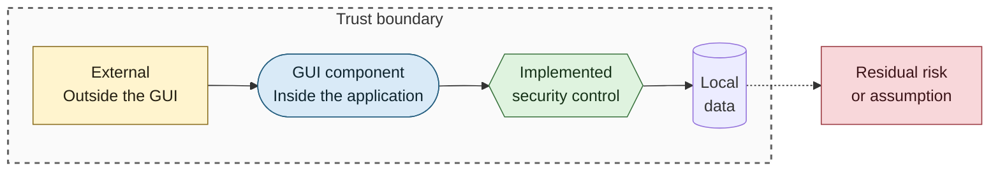

# Local Execution and Filesystem Security

## Purpose

This diagram shows the controls applied before the GUI starts an external Champollion process and the trust that remains after validation succeeds.

## Notation

See the [security diagram notation table](README.md#notation) for additional detail.

## Diagram

```mermaid
flowchart LR
    user["Local user"]:::external

    subgraph guiBoundary["GUI process trust boundary"]
        ui(["Workspace and run confirmation"]):::component
        compatibility{{"Edition, game, operation,<br/>and option compatibility"}}:::control
        pathValidation{{"Absolute local fixed-drive paths;<br/>existence, type, and extension checks"}}:::control
        outputValidation{{"Existing parent and protected<br/>Windows output restrictions"}}:::control
        builder{{"ProcessStartInfo.ArgumentList;<br/>no command-string concatenation"}}:::control
        launcher{{"UseShellExecute = false;<br/>redirect stdout and stderr"}}:::control
        search{{"Bounded search and conservative<br/>edition classification"}}:::control
    end

    subgraph userBoundary["Current Windows user boundary"]
        executable[("Selected Champollion distribution")]
        inputs[("PEX file or directory")]
        outputs[("Approved output directories")]
        cli["Champollion.exe process"]:::external
    end

    user -->|"Paths, operation, options,<br/>and confirmation"| ui
    ui --> compatibility
    ui --> pathValidation
    pathValidation --> outputValidation
    search -->|"Auto-discovered matching path"| pathValidation
    executable -->|"Path and distribution metadata"| search
    inputs -->|"Path and PEX enumeration"| pathValidation
    compatibility --> builder
    outputValidation --> builder
    builder --> launcher
    launcher -->|"Executable, working directory,<br/>and structured arguments"| cli
    inputs -->|"PEX bytes"| cli
    cli -->|"Generated source and assembly"| outputs
    cli -->|"stdout, stderr, and exit code"| launcher

    identityRisk["Manual or saved executable paths are not<br/>verified by signature, publisher, or hash"]:::risk
    privilegeRisk["External code runs unsandboxed with the<br/>GUI user's permissions and inherited environment"]:::risk
    contentRisk["PEX and generated-file semantics are handled<br/>by the separately trusted external CLI"]:::risk

    executable -.-> identityRisk
    cli -.-> privilegeRisk
    inputs -.-> contentRisk

    classDef external fill:#fff4ce,stroke:#8a6d1d,color:#241f12
    classDef component fill:#d9eaf7,stroke:#286182,color:#102630
    classDef control fill:#dff3df,stroke:#39733d,color:#173319
    classDef risk fill:#f8d7da,stroke:#9b3a42,color:#3d1519
    style guiBoundary fill:#f5f9fc,stroke:#286182,stroke-width:2px,stroke-dasharray:5 5
    style userBoundary fill:#fafafa,stroke:#666,stroke-width:2px,stroke-dasharray:5 5
```

## Implemented Controls

- File pickers filter executable and PEX selections, while `LocalPathValidator` performs the authoritative checks for typed and selected paths.
- UNC, mapped, removable, and other non-fixed-drive paths are rejected. Input files must exist and use `.pex`; executable paths must exist and use `.exe`.
- Output paths require an existing ancestor and are rejected under protected Windows roots unless they are application-owned output roots.
- The runner validates the complete request before creating output directories or starting the CLI.
- Each argument is a separate `ArgumentList` entry. The CLI is started without shell execution and with both output streams redirected.

## Residual Trust

- Path and distribution-layout checks do not prove executable authenticity or integrity.
- The CLI is neither bundled nor sandboxed by this repository and can access resources available to the current user.
- Auto-search classifies Legacy and Current layouts conservatively, but classification is not publisher verification.