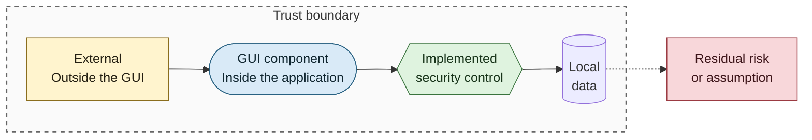
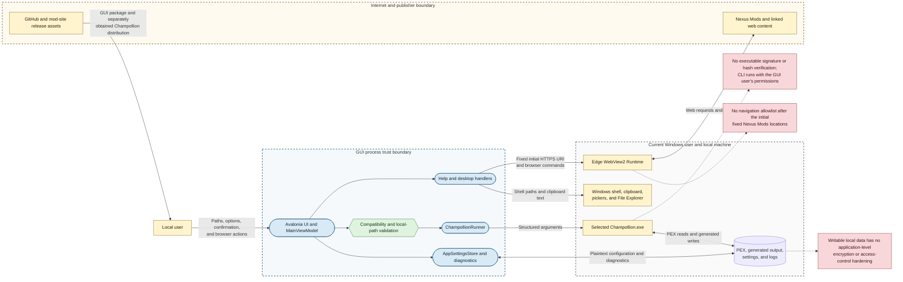

# Security Context and Trust Boundaries

## Purpose

This diagram identifies the GUI's principal attack surfaces, trust zones, implemented boundary controls, and dependencies that remain outside the application's assurance boundary.

## Notation

See the [security diagram notation table](README.md#notation) for additional detail.

## Diagram

## Security Posture

- The application has no account, authentication, authorization, server API, or inbound network listener.
- It executes locally with the current Windows user's authority; the external CLI is not sandboxed or privilege-separated.
- Validation reduces accidental and malformed path use but does not establish the identity or trustworthiness of a selected executable or PEX input.
- WebView2 is isolated from the decompilation request path at the application level, but rendered web content remains an external trust dependency.