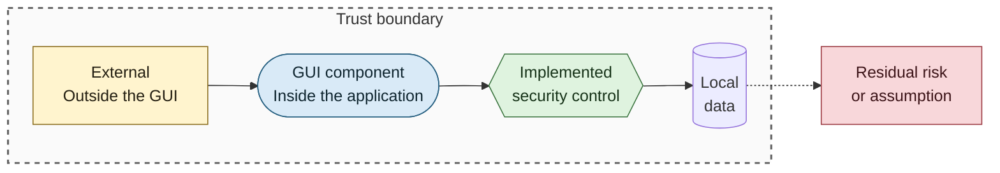
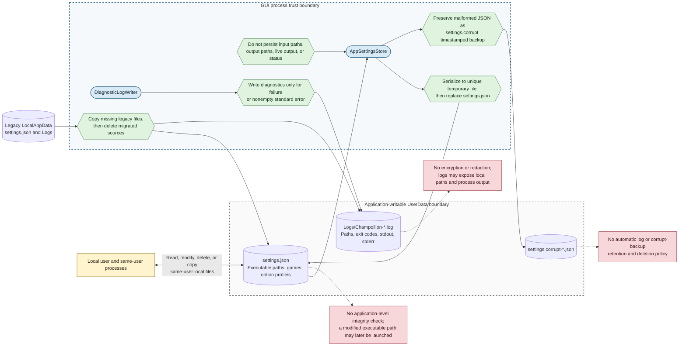

# Settings, Logs, and Local Data Security

## Purpose

This diagram shows local configuration and diagnostic data handling, resilience controls, and confidentiality and integrity limits of application-writable storage.

## Notation

See the [security diagram notation table](README.md#notation) for additional detail.

## Diagram

## Implemented Controls

- Settings replacement uses a unique temporary file and cleans it in a `finally` block, reducing partial-write exposure.
- Malformed JSON is moved aside and defaults are used; temporary I/O or access failures return defaults without misclassifying the file as corrupt.
- Migration copies settings and log files only when the destination is absent, then removes successfully migrated sources.
- Persisted settings contain executable paths, remembered games, and option profiles. PEX input and output paths remain transient.
- Diagnostic filenames are unique and logs are created only for failed processes or standard-error output.

## Data Protection Limits

- The application does not encrypt, sign, authenticate, redact, or assign narrower ACLs to settings, logs, or corrupt backups.
- The Windows installer deliberately grants ordinary users modify access to `UserData` and the application-owned output directories.
- Diagnostic logs retain complete input paths, standard output, and standard error until a user or external maintenance process removes them.