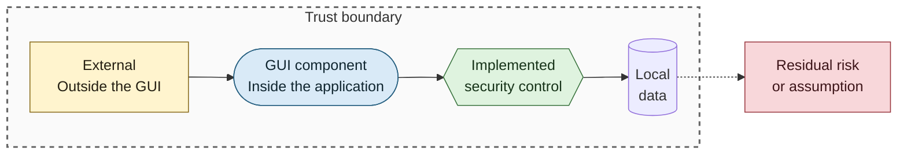
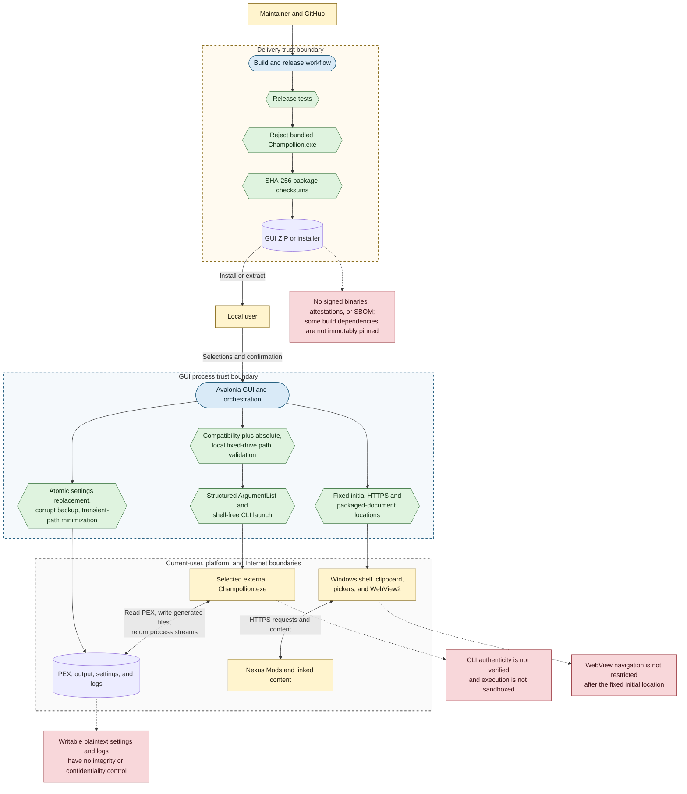

# Unified Security Controls

## Purpose

This diagram summarizes the primary runtime and delivery controls and the residual risks that cross the GUI's trust boundaries.

## Notation

See the [security diagram notation table](README.md#notation) for additional detail.

## Diagram

## Control Summary

- Runtime controls validate compatibility and local paths, constrain protected output locations, build structured arguments, avoid shell-based CLI launch, and capture process results.
- Local-data controls reduce partial writes, preserve malformed settings, minimize persisted path data, and create diagnostics only for noteworthy runs.
- Integration controls start from fixed HTTPS download pages, fixed packaged legal filenames, and existing directories passed as structured Explorer arguments.
- Delivery controls run release tests, reject bundled third-party executables, restrict workflow permissions by job, and produce SHA-256 checksum files.

## Priority Residual Risks

- A selected or settings-supplied executable is not authenticated before it runs with current-user authority.
- Settings and diagnostic logs are writable plaintext files; logs may retain local paths and complete external-process output.
- Embedded browsing can navigate beyond the fixed starting origins, and external desktop handlers remain trusted dependencies.
- Release artifacts are neither code-signed nor attested, and selected build dependencies are referenced by mutable versions.