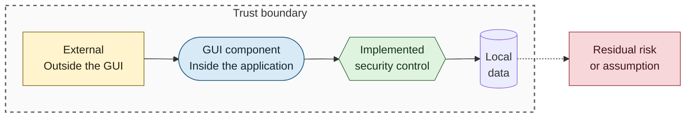
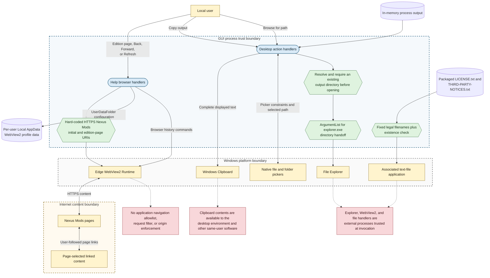

# WebView2 and Desktop Integration Security

## Purpose

This diagram shows the security boundaries crossed by embedded web browsing, clipboard writes, file and folder selection, File Explorer, and associated-application launches.

## Notation

See the [security diagram notation table](README.md#notation) for additional detail.

## Diagram

## Implemented Controls

- The initial Help URI and the two edition buttons use fixed HTTPS Nexus Mods locations.
- WebView2 user data is assigned to a per-user Local AppData directory instead of the installed application directory.
- Windows uninstall removes the application-specific WebView2 profile, including its cookies and cached login state.
- Legal-document actions combine the application directory with one of two fixed filenames and check existence before shell launch.
- Output-folder actions require a resolved existing directory and pass it to `explorer.exe` as one structured argument.
- Executable and PEX pickers expose extension filters, with authoritative path validation performed after selection.
- Clipboard integration writes the displayed output and does not read arbitrary clipboard content.

## Residual Trust

- The GUI does not subscribe to a navigation event to restrict origins or schemes after WebView2 displays the initial page. Page links and browser history can therefore leave the fixed locations.
- Web content, WebView2, File Explorer, clipboard consumers, and associated file handlers are outside the GUI process boundary.
- Copying output may disclose paths or tool output through clipboard history, synchronization, or other same-user software.