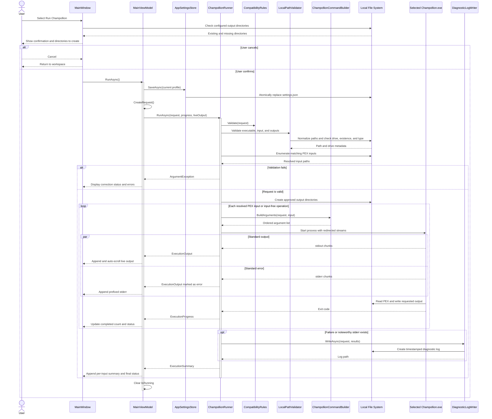

# Champollion Execution and Diagnostics Sequence Diagram

## Purpose

This diagram follows a confirmed operation through settings persistence, request validation, per-input process execution, live stream capture, progress reporting, and optional diagnostic logging.

## Notes

- The process working directory is the selected executable directory, and every argument is added through `ProcessStartInfo.ArgumentList`.
- Standard output, standard error, and process exit are all awaited before a file result is finalized.
- A failed input is recorded and summarized without preventing subsequent resolved inputs from being attempted.