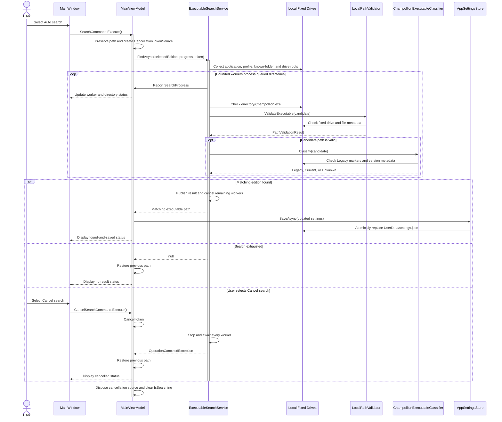

# Executable Discovery Sequence Diagram

## Purpose

This diagram shows the cancellable automatic search for a Legacy or Current `Champollion.exe`, including progress updates and alternate completion paths.

## Notes

- Search completion, exhaustion, and caller cancellation all stop and await the worker swarm before `FindAsync` finishes.
- A successful path is persisted for the selected edition; unsuccessful or cancelled search preserves the prior configuration.
- The first concurrently validated and edition-matching candidate wins, so multiple valid installations do not have a deterministic path order.