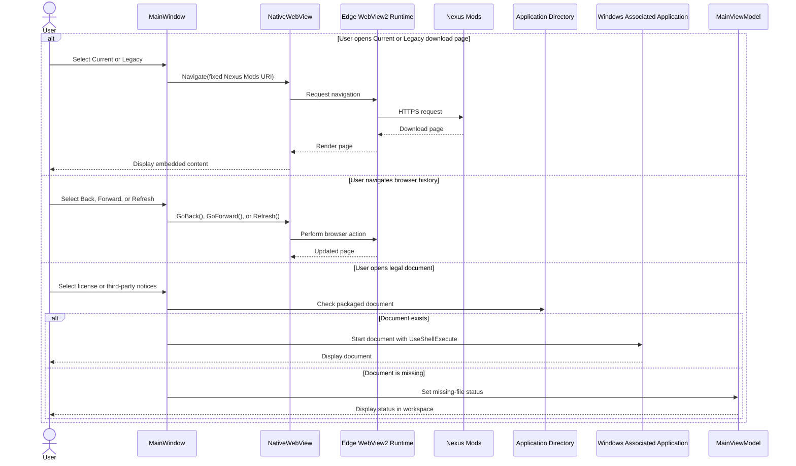

# Help Browser and About Documents Sequence Diagram

## Purpose

This diagram shows the Help tab's WebView2-backed Nexus Mods navigation and the About tab's packaged legal-document actions.

## Notes

- Current navigates to Starfield mod `4528`; Legacy navigates to Skyrim mod `35307`.
- WebView2 availability affects only the embedded download browser, not locally configured CLI execution.
- Legal documents are expected beside the running GUI executable because the project copies them to build and publish output.