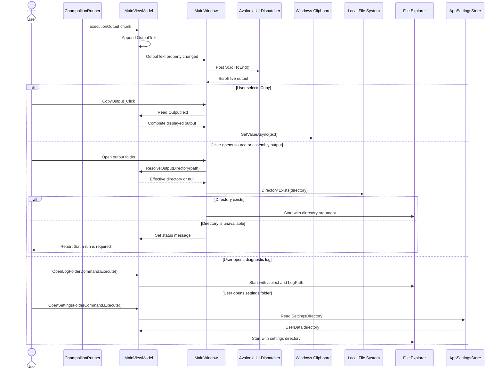

# Output and Desktop Actions Sequence Diagram

## Purpose

This diagram shows live-output auto-scroll, clipboard copy, and navigation to generated output, diagnostic logs, or application settings.

## Notes

- Auto-scroll is posted at background dispatcher priority after each `OutputText` property change.
- Output-folder resolution uses the configured path or falls back to the selected CLI executable's working directory.
- Clipboard and output-folder handlers remain in the view; generated log and settings commands are exposed by the view model.