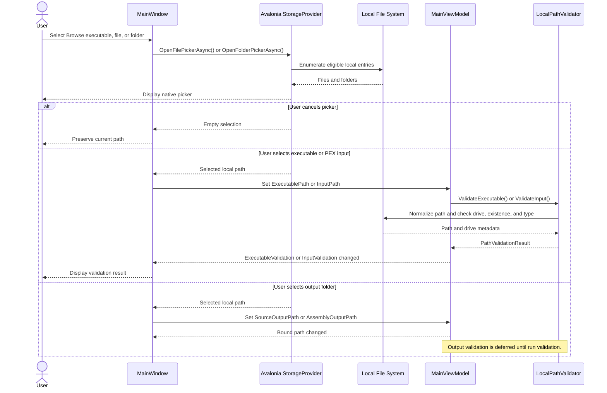

# Path Selection and Validation Sequence Diagram

## Purpose

This diagram shows native file or folder selection and the immediate validation performed when an executable or PEX input path changes.

## Notes

- Executable and PEX input paths are validated immediately through generated property-change hooks.
- Output selection updates GUI state immediately, but `ChampollionRunner` performs authoritative output validation before creating directories or starting the CLI.
- Environment variables are expanded and paths are normalized by Application-owned validation rather than picker code.