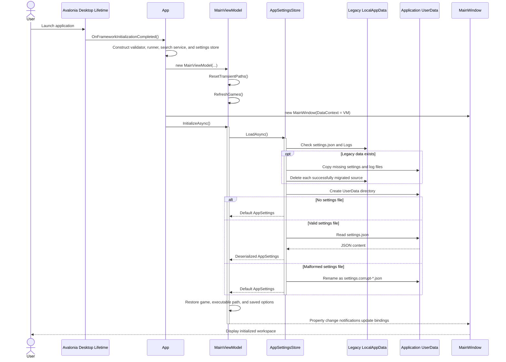

# Startup and Settings Sequence Diagram

## Purpose

This diagram shows desktop startup, service composition, legacy-data migration, settings loading, and initial view-model state restoration.

## Notes

- `App` starts `InitializeAsync` without blocking framework initialization; settings I/O continues asynchronously after the window is assigned.
- Input and output paths are initialized from application defaults, not loaded from settings.
- Temporary read failures return default settings without treating the file as malformed.