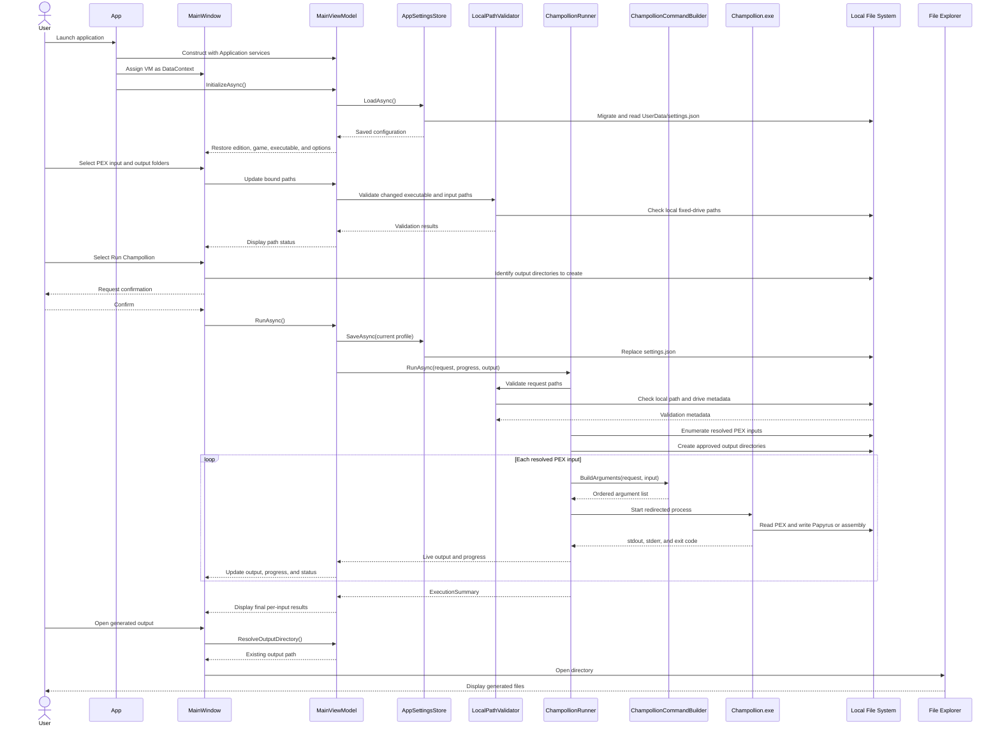

# Unified GUI Workflow Sequence Diagram

## Purpose

This diagram combines the primary happy path from application launch through configuration, confirmed decompilation, live output, and opening generated files.

## Notes

- This unified view follows the successful decompilation path. Focused sequence diagrams document cancellation, invalid paths, search exhaustion, process failures, diagnostic logging, and browser-only interactions.
- The GUI remains responsive because settings, search, process stream capture, and execution completion use asynchronous workflows.