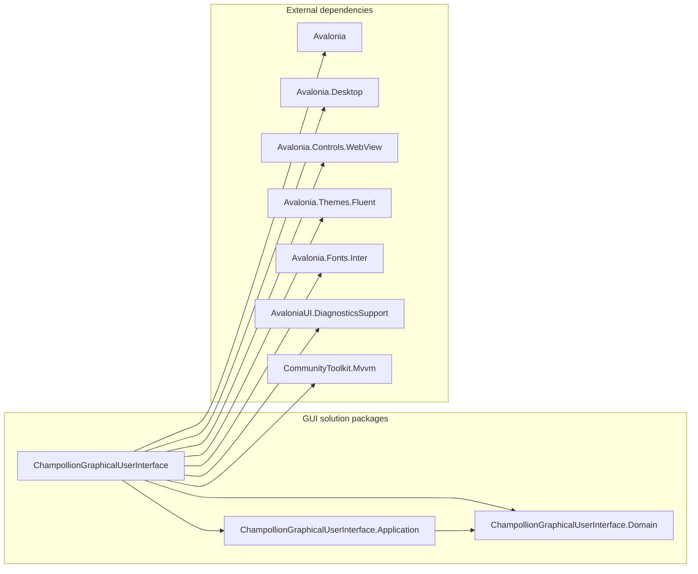

# Summary GUI Package Diagram

## Purpose

This diagram summarizes compile-time dependencies with each repository project collapsed to one package. External dependencies are grouped together and identified by package name only.

## Scope

- Each repository package represents one production project; internal namespaces and implementation types are intentionally omitted.
- Arrows represent direct project or NuGet package references declared by the production project files.
- Only direct external dependencies of the GUI project are included. Framework-provided assemblies and transitive packages are outside this summary.
- See the [GUI Package Diagram](gui-package-diagram.md) for internal GUI and Application package details.
- See the [Layered UML Package Diagram](uml-gui-package-diagram.md) for the same collapsed scope organized by architectural layer.