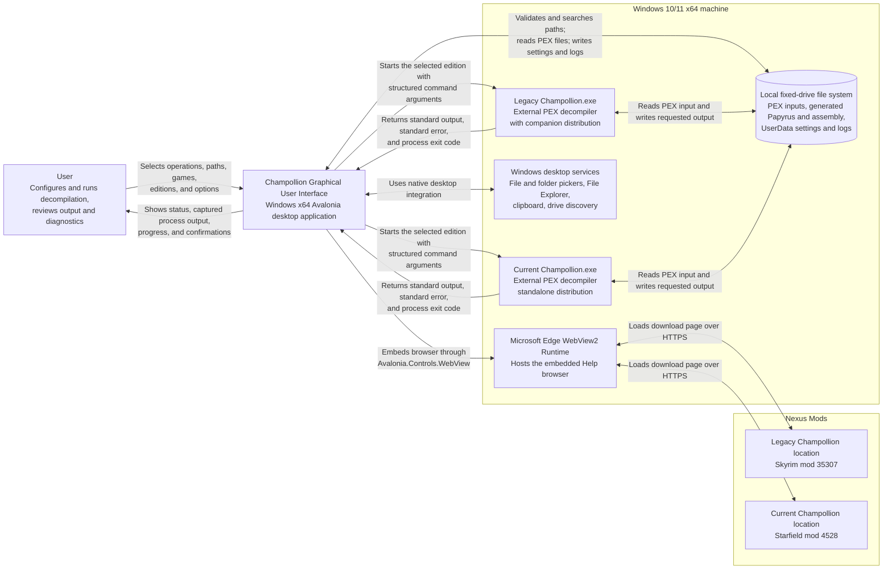

# System Context Diagram

## Purpose

This diagram shows Champollion Graphical User Interface as a single system and the people, software, storage, and web locations with which it directly interacts. Internal UI, Application, and Domain components are intentionally outside the scope of this view.

## Boundary Notes

- The application does not contain or distribute either Champollion executable. The user obtains an edition separately and selects its local `Champollion.exe`, or asks the application to search eligible local fixed drives.
- Legacy and Current Champollion are separate external command-line tools. The application supplies structured arguments, captures both output streams, and treats the process exit code as the success signal.
- The local file system holds selected `.pex` inputs, generated Papyrus source and optional assembly, application-adjacent `UserData/settings.json`, and diagnostic logs. Network, mapped, and removable drives are outside the supported path boundary.
- The Help browser uses `Avalonia.Controls.WebView` backed by the Microsoft Edge WebView2 Runtime. It opens the Legacy page at `https://www.nexusmods.com/skyrim/mods/35307` and the Current page at `https://www.nexusmods.com/starfield/mods/4528`.
- Windows desktop services provide file and folder selection, clipboard access, File Explorer navigation, fixed-drive discovery, and the WebView2 host. The currently supported product boundary is Windows 10/11 x64.