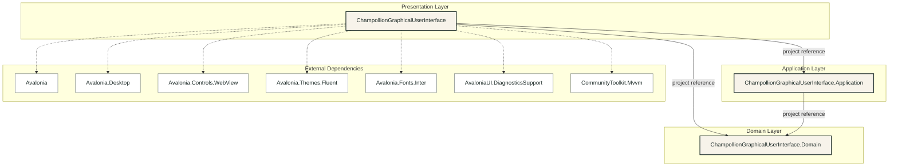

# Layered UML Package Diagram

## Purpose

This diagram presents the collapsed GUI solution packages and direct external dependencies as distinct architectural layers. Each production project remains a single package, and arrows show compile-time references between layers.

## Layers

| Layer | Package responsibility |
| --- | --- |
| Presentation | The Avalonia desktop project, composition root, views, view models, converters, and Windows-specific presentation integration. |
| Application | Use cases, DTOs, command construction, validation, paths, settings, executable search, process execution, and diagnostics. |
| Domain | Framework-independent requests, options, editions, operations, and supported-game vocabulary. |
| External Dependencies | Direct NuGet package references declared by the Presentation project, shown by package name only. |

Solid arrows are project references between architectural layers. Dashed arrows are direct external package references. Dependencies point inward from Presentation to Application and Domain, and from Application to Domain; Domain has no project or external package dependencies.

See the [Summary GUI Package Diagram](summary-gui-package-diagram.md) for a compact unlayered view and the [GUI Package Diagram](gui-package-diagram.md) for expanded internal package relationships.